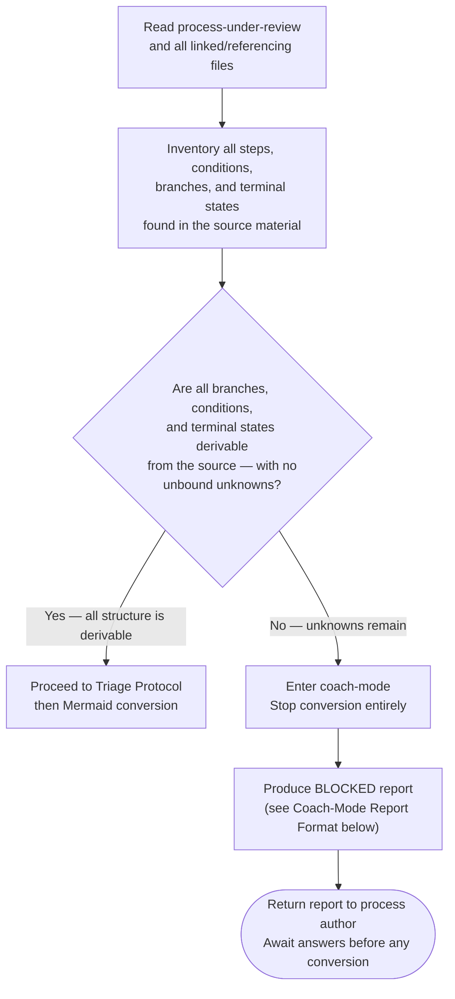
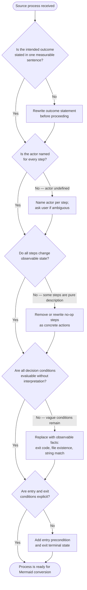
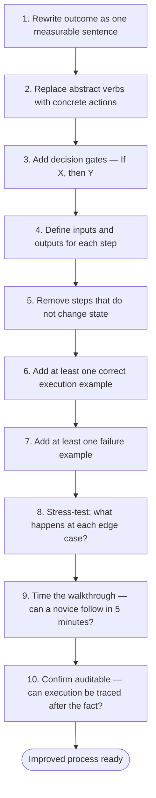

# Improve Processes

Process-siren's job is semantic fidelity. Faithful conversion of a flawed process encodes the flaws with false precision. Use this skill when the source process needs improvement before — or alongside — Mermaid conversion.

## When to Apply

Apply before converting when the source shows ANY of:

- Abstract verbs with no concrete action ("handle", "manage", "ensure")
- Conditions that cannot be evaluated by an AI agent ("when appropriate", "if needed")
- Missing entry or exit conditions
- Undefined actors ("we", "the system", "someone")
- Steps that do not change state (pure description, no action)
- No feedback loop or error path

## Frameworks (Reference Only)

These frameworks share one principle — a process must be deterministic, auditable, and actor-owned.

**Lean** (Ohno) — eliminate steps that produce no state change; apply 5 Whys to trace ambiguity to its root

**Six Sigma** / DMAIC (Smith) — Define outcome, Measure current state, Analyze gap, Improve, Control recurrence

**BPR** (Hammer) — radical question: "If we started from scratch, what would this look like?"

**Design Thinking** (IDEO/Brown) — Empathize with the agent executing the process; design for their decision points

**Systems Thinking** (Senge) — identify feedback loops and side effects before encoding structure

**Theory of Constraints** (Goldratt) — find the bottleneck step; simplify around it before adding branches

**Antifragility** (Taleb) — prefer processes that improve under stress over processes that merely tolerate it

## Excellence Checklist

Before converting, verify the source process satisfies:

- [ ] Clarity — no interpretive gaps; every term has one meaning
- [ ] Determinism — same input produces same output, independent of executor
- [ ] Minimal cognitive load — relies on structure, not memory
- [ ] Explicit feedback loops — error paths and retry conditions stated
- [ ] Measurable outcomes — each terminal state has an observable signal
- [ ] Visible constraints — blockers and preconditions named, not implied
- [ ] Ownership — every step names the actor
- [ ] Edge case coverage — at least one failure scenario is handled
- [ ] Teachable in 5 minutes — a novice can follow it cold
- [ ] Auditable — execution can be traced and verified after the fact

## Pre-Conversion Completeness Gate

After reading the process-under-review and all linked or referencing files, evaluate this gate before any Mermaid conversion begins.

**Question:** Are all branches, conditions, and terminal states derivable from what has been read — with no unbound unknowns?



### Why This Gate Exists

Converting an incomplete process produces a diagram that looks authoritative but encodes ambiguity as if it were resolved. An AI agent reading that diagram will follow the false structure and behave incorrectly. Coach-mode surfaces the incompleteness instead of hiding it.

### Coach-Mode Report Format

When the gate returns NO, produce this report — do not produce any Mermaid:

```text
CONVERSION ASSESSMENT

Goal:
- [One sentence stating what the process is intended to accomplish]

Source material read:
- [List each file or section examined, with path or reference]

What is known (derivable from source):
- [Fact 1 — cite the source section]
- [Fact 2 — cite the source section]
- ...

What is unknown or unbound:
- [Missing branch] | Gap: [what is undefined] | Source: [which file/section is silent on this]
- [Ambiguous condition] | Gap: [what observable fact is missing] | Source: [which file/section]
- [Undefined terminal state] | Gap: [what success/failure looks like] | Source: [absent from all files]
- [Step referencing undefined thing] | Gap: [the undefined reference] | Source: [where the reference appears]

Questions the process author must answer before conversion can proceed:

[Category — e.g., Branching Conditions]:
- [Question 1] (needed because: [why this blocks a specific diagram node or edge])
- [Question 2] (needed because: ...)

[Category — e.g., Terminal States]:
- [Question] (needed because: ...)

Decision:
- BLOCKED

Conversion will proceed once all questions above are answered.
```

**Report field rules:**

- "What is known" — list only facts directly readable or unambiguously derivable from the source files; cite the source for each
- "What is unknown or unbound" — list only genuine gaps; do not list things that are merely implicit if the implication is unambiguous
- "Questions" — one question per gap; ask only what is missing; do not ask about things already answered in the source
- "BLOCKED" is the only valid verdict when the gate returns NO; there is no partial conversion

## Triage Protocol



## Practical Improvement Framework

Apply in sequence when rebuilding a weak process:



SOURCE: Synthesized from user-provided source material (2026-02-26) drawing on Lean, Six Sigma/DMAIC, BPR, Design Thinking, Systems Thinking, Theory of Constraints, and process design literature including Deming, Drucker, Gawande (*The Checklist Manifesto*), Meadows (*Thinking in Systems*), Norman (*The Design of Everyday Things*), Allen (*Getting Things Done*), Clear (*Atomic Habits*), and Taleb.
