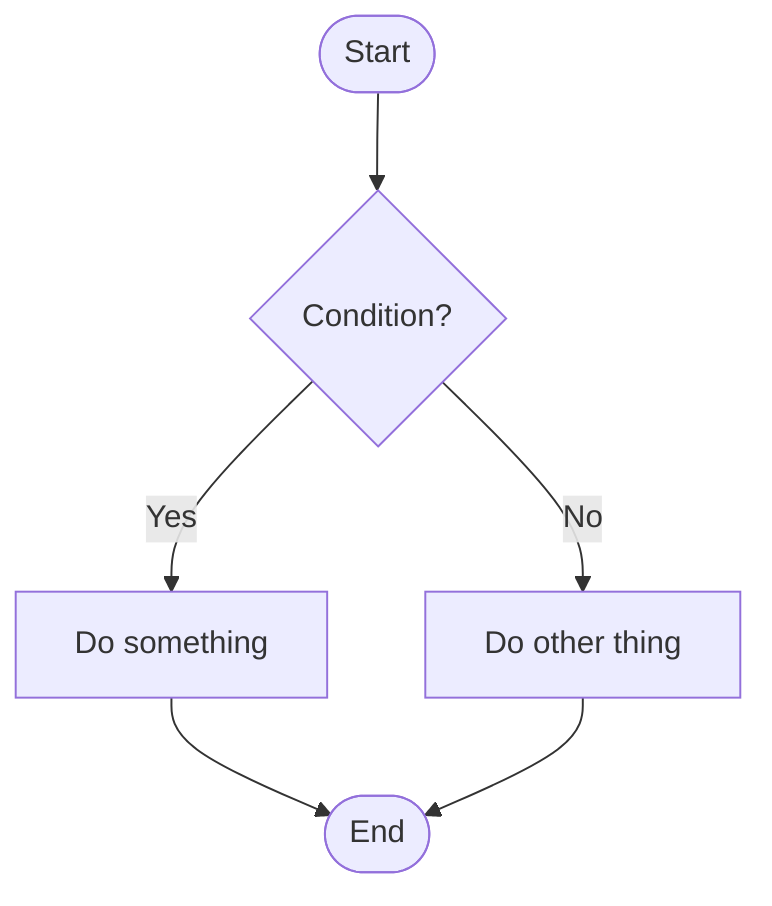
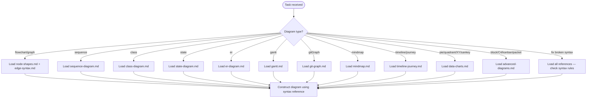

# Mermaid Diagram Syntax

Complete syntax reference for all Mermaid diagram types. Enables AI agents to construct valid diagrams with correct syntax, structure, and configuration across flowcharts, sequence diagrams, class diagrams, state diagrams, ER diagrams, gantt charts, git graphs, mindmaps, timelines, user journeys, data charts, and advanced diagram types.

## Scope

TRIGGER: Activate when the user asks to create, fix, or modify any Mermaid diagram, or when generating Mermaid diagram code of any type.

COVERS:

- Flowchart/graph diagrams — node shapes, edge types, subgraphs, styling, interactivity
- Sequence diagrams — actors, messages, loops, activations, notes
- Class diagrams — classes, relationships, methods, visibility
- State diagrams — states, transitions, composite states, forks
- Entity-relationship diagrams — entities, attributes, relationships
- Gantt charts — tasks, sections, dependencies, date formats
- Git graphs — commits, branches, merges, cherry-picks
- Mindmaps — nodes, icons, classes, shapes
- Timeline and user journey diagrams
- Data charts — pie, quadrant, XY chart, sankey
- Advanced diagrams — block, C4, kanban, packet

DOES NOT COVER:

- Mermaid.js API or rendering engine internals
- HTML/JavaScript integration beyond click callbacks

## Quick Reference — Common Patterns

**Direction codes:** `TD`/`TB` = top-down, `LR` = left-right, `BT` = bottom-up, `RL` = right-left

**Essential node shapes:**

| Shape | Classic Syntax | v11.3.0+ Syntax |
|-------|---------------|-----------------|
| Rectangle | `A[text]` | `A@{ shape: rect }` |
| Rounded | `A(text)` | `A@{ shape: rounded }` |
| Stadium | `A([text])` | `A@{ shape: stadium }` |
| Diamond | `A{text}` | `A@{ shape: diamond }` |
| Circle | `A((text))` | `A@{ shape: circle }` |
| Database | `A[(text)]` | `A@{ shape: cyl }` |

**Essential edge types:**

| Type | Syntax |
|------|--------|
| Arrow | `A --> B` |
| Arrow + text | `A -->\|text\| B` |
| Dotted arrow | `A -.-> B` |
| Thick arrow | `A ==> B` |
| Open link | `A --- B` |

## Workflow

For flowchart styling, subgraphs, and interactivity, also load [subgraphs-and-layout.md](./references/subgraphs-and-layout.md) and [styling-and-config.md](./references/styling-and-config.md).

For the full 6-phase flowchart element selection process (direction, shape, edge, label, grouping, styling), see [Flowchart Construction Decision Process](./references/flowchart-construction.md).

## Reference Files

### Flowchart References

[Node Shapes](./references/node-shapes.md) — All node shape syntaxes — classic bracket notation and v11.3.0+ `@{ shape: ... }` notation. Includes the complete shape catalog with semantic names, short names, and aliases. Load when constructing nodes or choosing appropriate shapes.

[Edge Syntax](./references/edge-syntax.md) — All edge/link types — solid, dotted, thick, invisible, circle, cross, and multi-directional arrows. Covers edge IDs, animations, text labels, chaining, and the minimum length table. Load when connecting nodes or styling edges.

[Subgraphs and Layout](./references/subgraphs-and-layout.md) — Subgraph declaration, explicit IDs, nested direction control, direction limitation for external links. Also covers diagram direction codes, Markdown strings, special character escaping, entity codes, and comments. Load when grouping nodes or controlling layout.

[Styling and Configuration](./references/styling-and-config.md) — Node styling, link styling, classDef, CSS classes, click interactivity, tooltips, FontAwesome icons, custom icons, renderer selection (dagre/elk), and line curve configuration. Load when styling diagrams or adding interactive elements.

[Flowchart Construction](./references/flowchart-construction.md) — 6-phase element selection process: direction, shape, edge, label, grouping, styling. Decision trees for flowchart construction. Load when building a flowchart from scratch.

### Other Diagram Types

[Sequence Diagram](./references/sequence-diagram.md) — Actors, messages, loops, alt/opt/par blocks, activations, notes, and autonumbering. Load when constructing sequence diagrams.

[Class Diagram](./references/class-diagram.md) — Classes, attributes, methods, visibility, relationships (inheritance, composition, aggregation, dependency), and namespaces. Load when constructing class diagrams.

[State Diagram](./references/state-diagram.md) — States, transitions, composite states, fork/join, concurrency, and notes. Load when constructing state diagrams.

[ER Diagram](./references/er-diagram.md) — Entities, attributes, relationship cardinality, and keys. Load when constructing entity-relationship diagrams.

[Gantt](./references/gantt.md) — Tasks, sections, dependencies, date formats, exclusions, and milestones. Load when constructing gantt charts.

[Timeline and Journey](./references/timeline-journey.md) — Timeline events with dates and sections; user journey tasks with scores and actors. Load when constructing timeline or user journey diagrams.

[Git Graph](./references/git-graph.md) — Commits, branches, merges, cherry-picks, tags, and theme variables. Load when constructing git graph diagrams.

[Mindmap](./references/mindmap.md) — Root nodes, child nodes, icons, classes, and shapes. Load when constructing mindmap diagrams.

[Data Charts](./references/data-charts.md) — Pie charts, quadrant charts, XY charts, and sankey diagrams. Load when constructing data visualization diagrams.

[Advanced Diagrams](./references/advanced-diagrams.md) — Block diagrams, C4 architecture diagrams, kanban boards, and packet diagrams. Load when constructing advanced or specialized diagram types.

## Critical Constraints

- The word `end` in all lowercase breaks flowcharts — capitalize as `End` or `END`
- Starting a node connection with `o` or `x` creates circle/cross edges — add a space or capitalize
- Subgraph direction is ignored when any subgraph node links to an external node
- Click interactivity requires `securityLevel='loose'` — disabled in `strict` mode
- Commas in `stroke-dasharray` must be escaped as `\,` in `classDef` statements

## References

[1] [Mermaid Flowchart Syntax Documentation](https://github.com/mermaid-js/mermaid/blob/develop/packages/mermaid/src/docs/syntax/flowchart.md) (accessed 2026-03-07)

[2] [Mermaid Official Site — Flowchart Syntax](https://mermaid.ai/open-source/syntax/flowchart.html) (accessed 2026-03-07)
