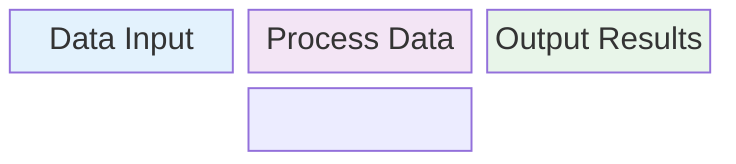
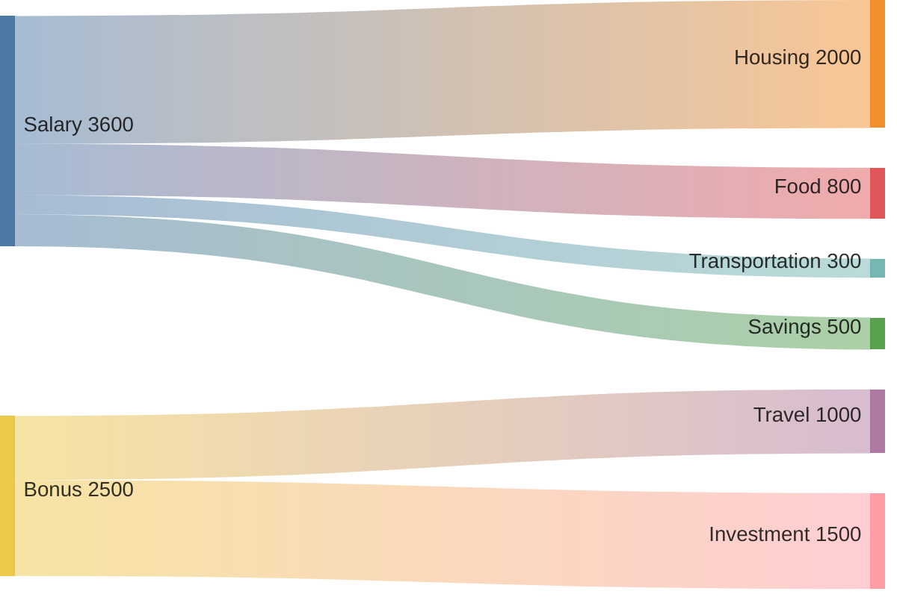
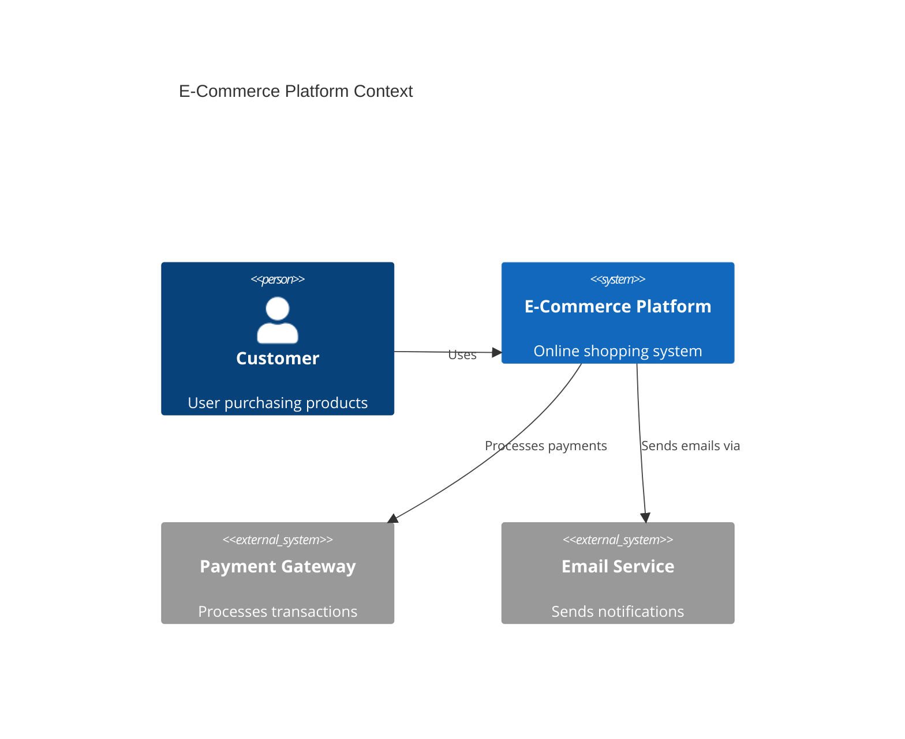
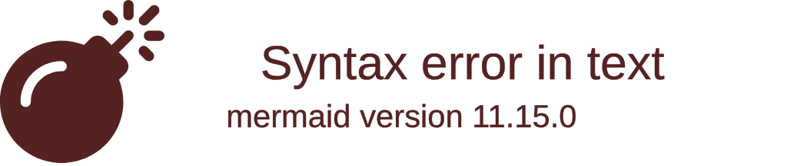
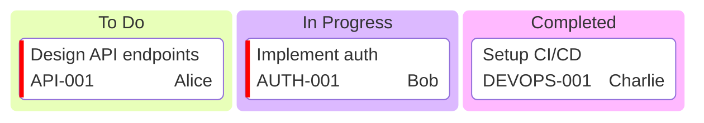
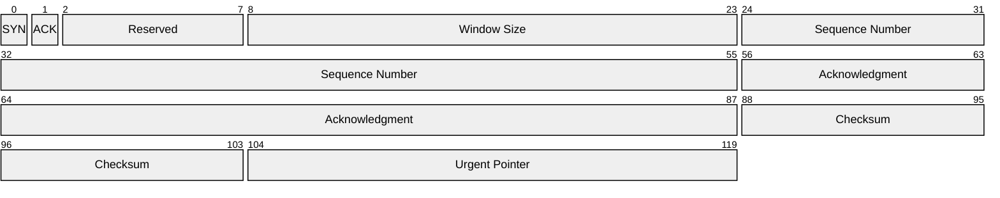
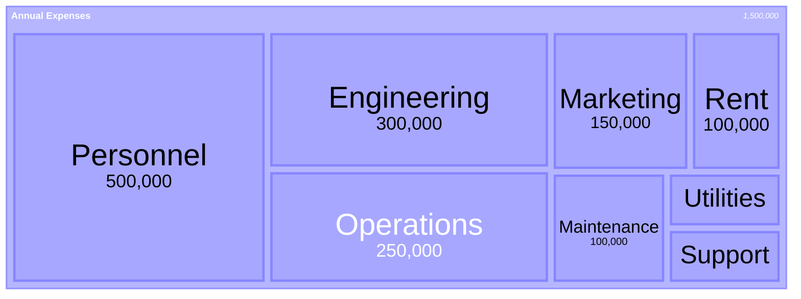
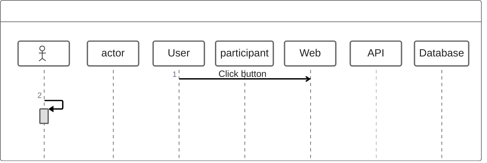

> Parent: [Mermaid Diagram Syntax](../SKILL.md)

# Advanced Diagram Types

Less-common but powerful Mermaid diagram types. Each section covers the declaration keyword, core syntax constructs, and one working example.

SOURCE: [Mermaid.js Official Documentation](https://mermaid.js.org) (accessed 2026-03-07) — Mermaid v11.12.3+

---

## Block Diagram

**Declaration**: `block-beta`

**Core constructs:**

- `columns N` — set grid width
- `BlockID["Label"]` — named block (rectangle default)
- `BlockID[N]` — block spanning N columns
- `space` / `space:N` — empty cell(s)
- Nested composite: `Outer[ Inner1 Inner2 ]`
- Edges: `A --> B`, `A --> |label| B`, `A --- B`, `A -. B`
- Shapes: `(rounded)`, `([stadium])`, `((circle))`, `{rhombus}`, `[(cylinder)]`
- Styling: `style A fill:#f9f`, `classDef name fill:#0f0`



---

## Sankey Diagram

**Declaration**: `sankey-beta`

**Core constructs:**

- CSV format — three columns: `source,target,value`
- First row is data (no header row)
- Values must be positive numbers
- Wrap values containing commas in quotes
- `linkColor`: `source` | `target` | `gradient` | hex
- `nodeAlignment`: `justify` | `center` | `left` | `right`



---

## C4 Diagram

**Declaration**: `C4Context` | `C4Container` | `C4Component` | `C4Dynamic` | `C4Deployment`

**Status**: Experimental — syntax may change

**Diagram types:**

| Keyword | View |
|---------|------|
| `C4Context` | System context — people and systems |
| `C4Container` | Container breakdown within a system |
| `C4Component` | Component details within a container |
| `C4Dynamic` | Interaction sequences |
| `C4Deployment` | Infrastructure deployment |

**Core constructs:**

- `Person(id, "Label", "Description")` — human actor
- `System(id, "Label", "Description")` — internal system
- `System_Ext(id, "Label", "Description")` — external system
- `Container(id, "Label", "Tech", "Description")` — container
- `Rel(from, to, "Label")` — relationship
- `UpdateElementStyle("id", color, text_color)` — override element style
- `UpdateRelStyle(from, to, color, text)` — override relationship style



---

## Architecture Diagram

**Declaration**: `architecture-beta`

**Introduced**: v11.1.0+

**Core constructs:**

- `service id(icon)[Label]` — service node; built-in icons: `cloud`, `database`, `disk`, `internet`, `server`
- `group id(icon)[Label]` — named group containing services
- `junction id` — connection point for branching edges
- Edge syntax: `serviceA:SIDE --> SIDE:serviceB` where SIDE is `T` | `R` | `B` | `L`
- Arrow types: `-->` (right), `<--` (left), `<-->` (bidirectional), `--` (none)
- Extended icons via `name:icon-name` format (iconify.design)



---

## Kanban Diagram

**Declaration**: `kanban`

**Introduced**: v11.1.0+

**Core constructs:**

- `columnId[Column Title]` — board column
- `taskId[Task Description]` — item within a column (indented under column)
- Task metadata block: `taskId[Name]@{ assigned: "User", ticket: "ID", priority: "Level" }`
- Priority values: `Very High` | `High` | `Medium` | `Low` | `Very Low`
- Config option: `ticketBaseUrl` — template URL for ticket links (use `#TICKET#` placeholder)



---

## Packet Diagram

**Declaration**: `packet-beta`

**Core constructs:**

- Absolute range syntax: `0-7: "Field Name"` — field spans bit positions 0 through 7
- Relative bits syntax (v11.7.0+): `+N: "Field Name"` — field occupies N bits from current position
- Config options: `bitsperrow` (default 32), `bitwidth`, `rowheight`, `showbits`



---

## Requirement Diagram

**Declaration**: `requirementDiagram`

**Core constructs:**

- Requirement block types: `requirement`, `functionalRequirement`, `interfaceRequirement`, `performanceRequirement`, `physicalRequirement`, `designConstraint`
- Requirement fields: `id`, `text`, `risk` (`Low` | `Medium` | `High`), `verifymethod` (`Analysis` | `Inspection` | `Test` | `Demonstration`)
- Element block: `element id { type: T, docref: path }` — implementation artifact
- Relationship: `reqA - <type> -> reqB` where type is `contains` | `copies` | `derives` | `satisfies` | `verifies` | `refines` | `traces`

```mermaid
requirementDiagram
    requirement authentication {
        id: AUTH-001
        text: System shall support user authentication
        risk: High
        verifymethod: Test
    }

    requirement password_strength {
        id: AUTH-002
        text: Passwords must be at least 8 characters
        risk: Medium
        verifymethod: Analysis
    }

    element login_service {
        type: Software
        docref: docs/auth-service
    }

    authentication - contains -> password_strength
    authentication - satisfies -> login_service
```

---

## Radar Chart

**Declaration**: `radar-beta`

**Introduced**: v11.6.0+

**Core constructs:**

- `axis A, B, C, ...` — define axis labels (comma-separated)
- `curve "Name" {v1, v2, v3, ...}` — one data series; values correspond to axes in order
- Config options: `showLegend`, `max`, `min`, `graticule` (`circle` | `polygon`), `ticks`


---

## Treemap Diagram

**Declaration**: `treemap-beta`

**Introduced**: v11.6.0+

**Core constructs:**

- `"Parent Section"` — container node (no value; quoted)
- `"Leaf Node" : N` — leaf node with numeric value
- Indentation defines hierarchy depth
- Config options: `showValues`, `valueFormat` (D3 number format specifier), `padding`, `useMaxWidth`



---

## Venn Diagram

**Declaration**: `venn-beta`

**Introduced**: v11.12.3+

**Core constructs:**

- `set A["Label"]` — define a named set
- `set A: N` — optional size modifier
- `text A: "Content"` — text inside a set region
- `text AB: "Content"` — text inside the intersection of sets A and B
- `text ABC: "Content"` — text inside triple intersection
- Intersection IDs are formed by concatenating set IDs in declaration order (no separator)

```mermaid
venn-beta
    title Programming Language Skills

    set Python["Python"]
    set JavaScript["JavaScript"]
    set Go["Go"]

    text Python: "Data Science<br/>ML"
    text JavaScript: "Web<br/>Frontend"
    text Go: "DevOps<br/>Performance"

    text PythonJavaScript: "Scripting<br/>Backends"
    text PythonGo: "Automation"
    text PythonJavaScriptGo: "Full Stack"
```

---

## ZenUML Diagram

**Declaration**: `zenuml`

**Core constructs:**

- Participants: `actor Name`, `participant Name as Alias`
- Synchronous message: `A -> B: Label` (blocking)
- Asynchronous message: `A => B: Label` (fire-and-forget)
- Reply: `A <- B: Label`
- Object creation: `new ClassName: label`
- Control flow: `loop "condition" { }`, `if "cond" { } else { }`, `opt "label" { }`, `par { } par { } end`, `try { } catch { } finally { }`
- Comments: `// text` (supports `**bold**` and `*italic*`)



---

## See Also

- [Flowchart Syntax](../SKILL.md)
- [Data Charts](./data-charts.md)
- [Mindmap](./mindmap.md)
