> Parent: [Mermaid Diagram Syntax](../SKILL.md)

# Class Diagram Syntax Reference

Complete syntax reference for Mermaid `classDiagram` diagrams — class definitions, visibility modifiers, relationship types, cardinality, generics, annotations, namespaces, notes, direction, and links.

## Declaration

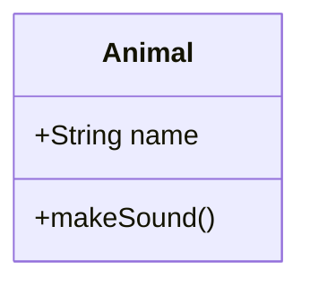

The keyword `classDiagram` opens the diagram. No direction qualifier is required at the declaration line — set direction with `direction` inside the body.

## Class Definition

Two forms are valid:

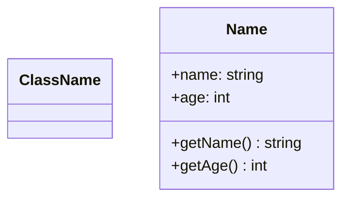

The bare form (`class ClassName`) declares a class with no members. The block form uses `{}` to list attributes and methods. Type annotations follow the member name after a colon or space, and return types follow the method signature.

## Attributes and Methods

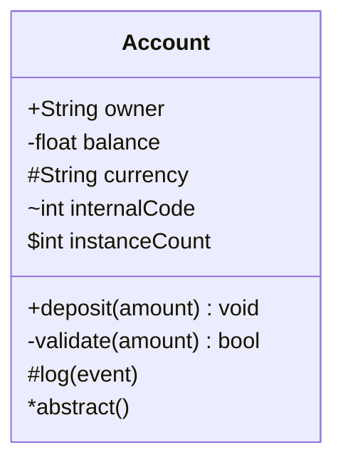

Visibility prefixes:

| Prefix | Visibility |
|--------|-----------|
| `+` | Public |
| `-` | Private |
| `#` | Protected |
| `~` | Package / Internal |
| `$` | Static (attribute or method) |
| `*` | Abstract (method only) |

Methods use `()` after the name. Parameters go inside the parens. Return type follows the closing paren.

## Relationship Types

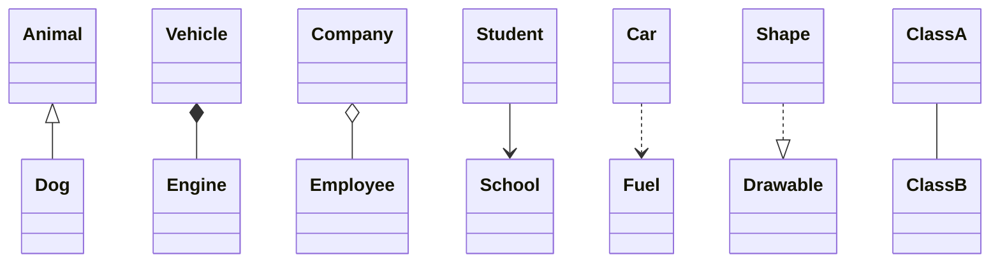

| Syntax | Relationship | Meaning |
|--------|-------------|---------|
| `<\|--` | Inheritance | Subclass extends superclass |
| `*--` | Composition | Strong ownership; child cannot exist without parent |
| `o--` | Aggregation | Weak ownership; child can exist independently |
| `-->` | Association | General directed relationship |
| `..>` | Dependency | One class uses another |
| `..\|>` | Realization | Class implements an interface |
| `--` | Link | Undirected solid line |

Arrow direction can be reversed: `Dog --|> Animal` produces the same inheritance as `Animal <|-- Dog`.

## Relationship Labels and Cardinality

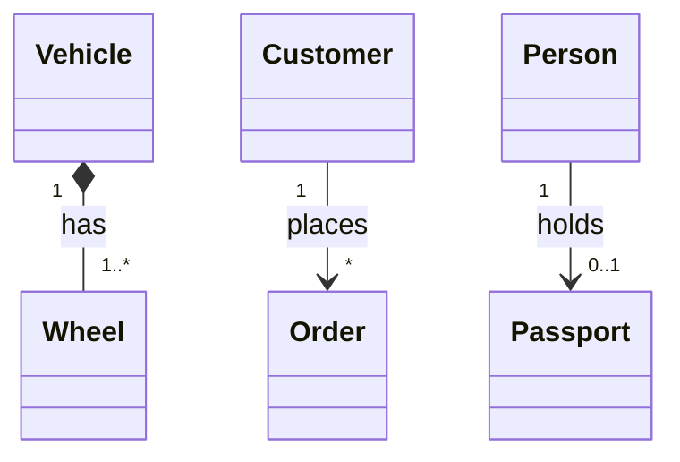

Cardinality strings go in double quotes on each side of the relationship operator. A label string follows a colon after the operator.

Common cardinality values: `1`, `*`, `0..1`, `1..*`, `0..*`, `n`.

## Generic Types

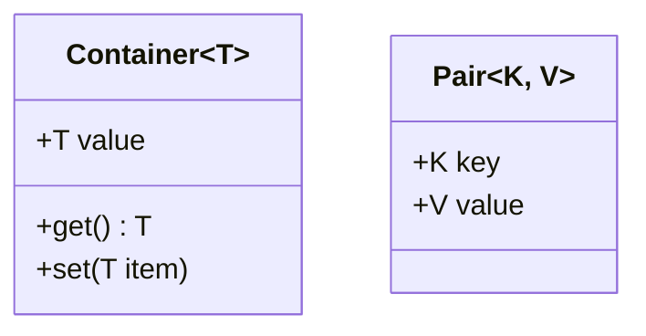

Generic type parameters use `~T~` syntax on the class name. Multiple parameters are comma-separated inside the tildes.

## Annotations

Annotations render as stereotypes inside the class box.

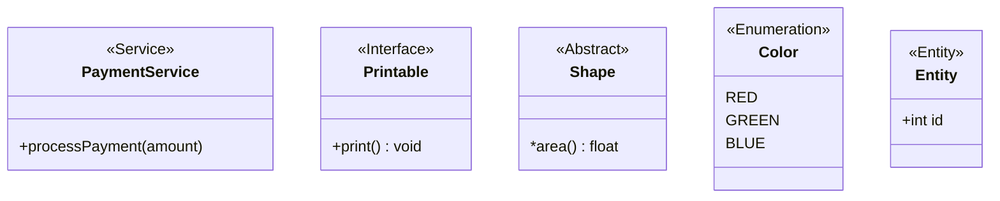

Built-in annotations: `<<Interface>>`, `<<Abstract>>`, `<<Service>>`, `<<Enumeration>>`, `<<Entity>>`. Custom annotation strings are also valid — any text inside `<< >>` renders as a stereotype label.

## Notes

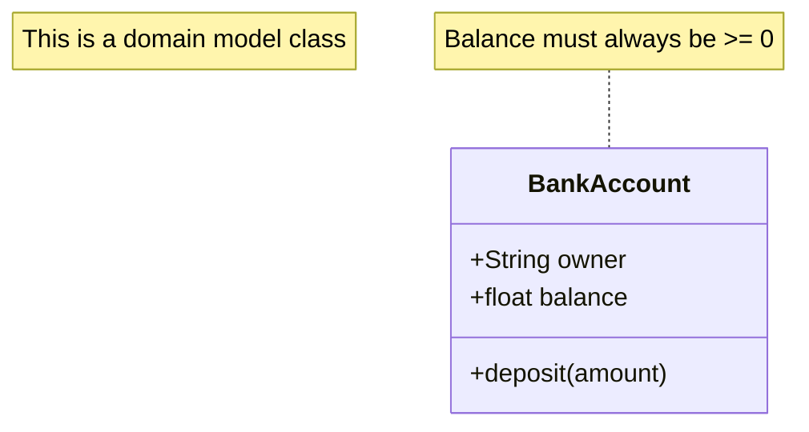

`note "text"` adds a floating note. `note for ClassName "text"` attaches the note to a specific class.

## Direction

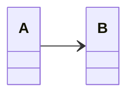

Valid values: `TB` (top-to-bottom, default), `BT` (bottom-to-top), `LR` (left-to-right), `RL` (right-to-left). Place the `direction` statement at the top of the diagram body.

## Links and Click Events

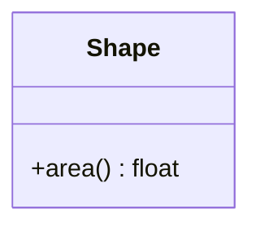

`link` adds a hyperlink to the class. `click ... href` adds a clickable link with tooltip. `click ... call` binds a JavaScript callback. Click interactivity requires `securityLevel='loose'` in the renderer configuration.

## Namespaces

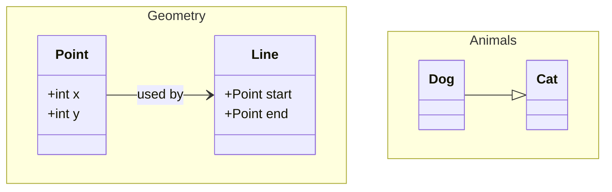

`namespace Name { ... }` groups classes visually. Cross-namespace relationships use the plain class names — no namespace prefix is needed in the relationship syntax.

## Complete Example

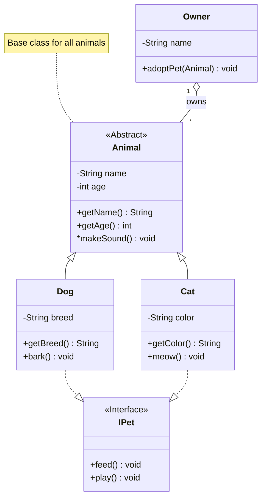

## v11+ Features

Mermaid v11 introduced `classDiagram-v2` as an alias — identical syntax to `classDiagram`. No behavioral difference; both keywords produce the same output.

SOURCE: [Mermaid Class Diagram Documentation](https://mermaid.js.org/syntax/classDiagram.html) (accessed 2026-03-07)

## See Also

- [Flowchart Syntax](../SKILL.md)
- [State Diagram](./state-diagram.md)
- [ER Diagram](./er-diagram.md)
- [Sequence Diagram](./sequence-diagram.md)
