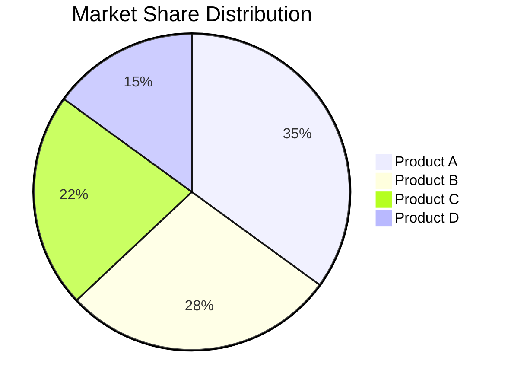
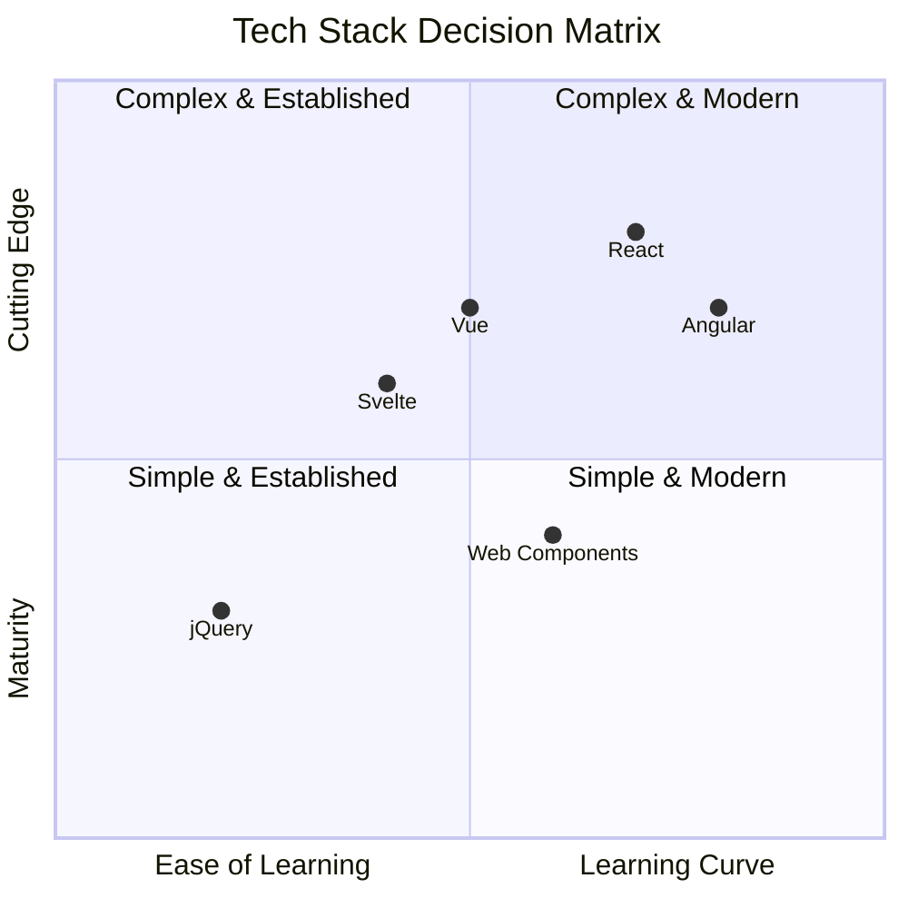
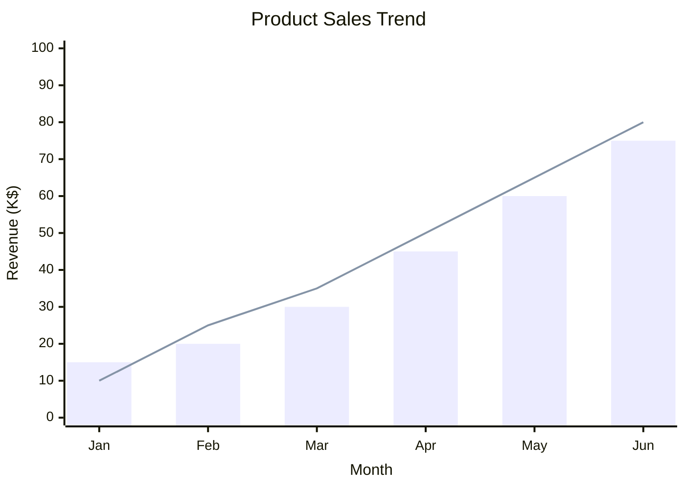

> Parent: [Mermaid Diagram Syntax](../SKILL.md)

# Data Visualization Charts

Reference for Mermaid data chart types — Pie, Quadrant, and XY.

---

## Pie Chart

**Declaration**: `pie` or `pie showData`

### Syntax

```text
pie title <TITLE>
    "Label" : value
```

- `title` — optional; follows `pie` keyword on the same line
- `showData` — optional flag; displays raw values alongside percentages
- Each data entry: `"Label" : value` — label in double quotes, numeric value after colon
- Values are relative; Mermaid normalizes them to 100%

### Options

```text
pie showData
    title Chart Title
    "Label 1" : 30
    "Label 2" : 25
```

### Configuration

```text
textPosition: 0.75    # Label position from center (0.0–1.0)
```

### Example



---

## Quadrant Chart

**Declaration**: `quadrantChart`

### Syntax

```text
quadrantChart
    title <TITLE>
    x-axis <LowLabel> --> <HighLabel>
    y-axis <LowLabel> --> <HighLabel>

    quadrant-1 <TopRight label>
    quadrant-2 <TopLeft label>
    quadrant-3 <BottomLeft label>
    quadrant-4 <BottomRight label>

    PointName: [x, y]
```

- `title` — optional chart title
- `x-axis` / `y-axis` — range labels using `-->` separator
- `quadrant-1` through `quadrant-4` — clockwise from top-right
- Data points: name followed by `[x, y]` coordinates in 0.0–1.0 range
- Point names may include spaces; no quotes required

### Configuration

```text
chartWidth: 500
chartHeight: 500
pointRadius: 5
titleFontSize: 20
xAxisPosition: 'top'
yAxisPosition: 'left'
```

### Example



---

## XY Chart

**Declaration**: `xychart-beta` (beta keyword required)

**Orientation**: vertical (default) or `xychart-beta horizontal`

### Syntax

```text
xychart-beta
    title "Chart Title"
    x-axis [cat1, cat2, cat3]       %% categorical
    x-axis "X Label" 0 --> 100      %% numeric range
    y-axis "Y Label" 0 --> 50       %% always numeric
    bar [val1, val2, val3]
    line [val1, val2, val3]
```

- `title` — optional; enclose in quotes if it contains spaces
- `x-axis` — categorical (bracket list) or numeric range (`label min --> max`)
- `y-axis` — numeric range only; label in quotes
- `bar` and `line` — one or more series; values as comma-separated array
- Multiple series of either type may be combined in one chart

### Configuration

```text
width: 700          # Default
height: 500         # Default
titleFontSize: 20
showDataLabels: false
```

### Example



---

## See Also

- [Flowchart Syntax](../SKILL.md)
- [Advanced Diagrams](./advanced-diagrams.md)
