> Parent: [Mermaid Flowchart Syntax](../SKILL.md)

# Mermaid Flowchart Edge Syntax

Complete reference for links, edges, and arrows in Mermaid flowchart diagrams. Covers all link types (normal, dotted, thick, invisible), arrow heads (standard, circle, cross, multi-directional), text on links, link chaining, edge IDs, edge animations, classDef for edges, and the minimum link length table.

## Table of Contents

- [Links Between Nodes](#links-between-nodes)
- [Link with Arrow Head](#link-with-arrow-head)
- [Open Link](#open-link)
- [Text on Links](#text-on-links)
- [Link with Arrow Head and Text](#link-with-arrow-head-and-text)
- [Dotted Link](#dotted-link)
- [Dotted Link with Text](#dotted-link-with-text)
- [Thick Link](#thick-link)
- [Thick Link with Text](#thick-link-with-text)
- [Invisible Link](#invisible-link)
- [Chaining of Links](#chaining-of-links)
- [Edge IDs](#edge-ids)
- [Edge Animations](#edge-animations)
- [classDef for Edge Animations](#classdef-for-edge-animations)
- [Circle Edge](#circle-edge)
- [Cross Edge](#cross-edge)
- [Multi-Directional Arrows](#multi-directional-arrows)
- [Minimum Length of a Link](#minimum-length-of-a-link)
- [Link Length Table](#link-length-table)
- [References](#references)

## Links Between Nodes

Nodes can be connected with links/edges. It is possible to have different types of links or attach a text string to a link.

## Link with Arrow Head


## Open Link

A link without an arrow head, using three dashes.

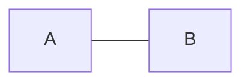

## Text on Links

Two equivalent syntaxes for adding text to an open link:

**Inline text between dashes:**

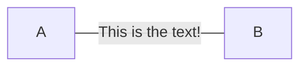

**Pipe-delimited text:**

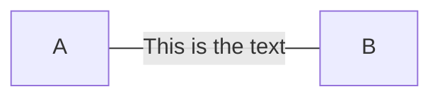

## Link with Arrow Head and Text

Two equivalent syntaxes for adding text to an arrow link:

**Pipe-delimited text:**

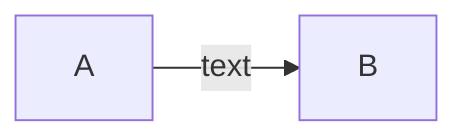

**Inline text between dashes:**


## Dotted Link


## Dotted Link with Text

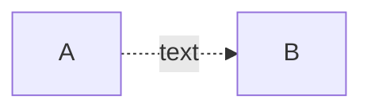

## Thick Link

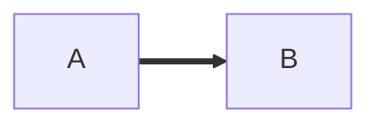

## Thick Link with Text

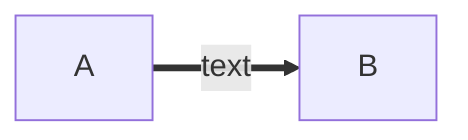

## Invisible Link

Useful for altering the default positioning of a node without drawing a visible connection.

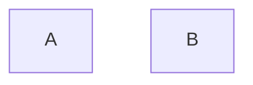

## Chaining of Links

Multiple links can be declared in the same line.

**Sequential chaining with text:**

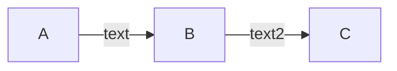

**Branching with ampersand (`&`):**

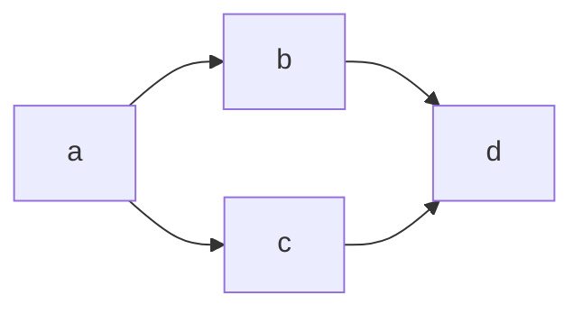

**Multi-source to multi-target (expressive one-liner):**

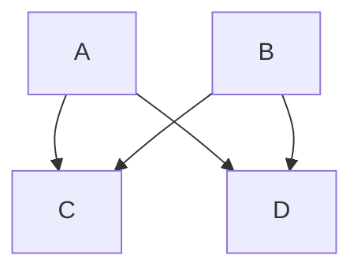

The above is equivalent to writing four separate link statements:


## Edge IDs

Mermaid supports assigning IDs to edges. Prepend the edge syntax with the ID followed by an `@` character.


In this example, `e1` is the ID of the edge connecting `A` to `B`. The ID can be used in later definitions or style statements.

## Edge Animations

### Turning an Animation On

Once an edge has an ID, enable animation by defining the edge's properties:

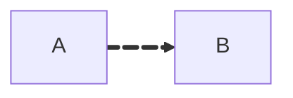

### Selecting Type of Animation

Two animation speeds are supported: `fast` and `slow`. Selecting a specific animation type is shorthand for enabling animation and setting the speed in one go.


This is equivalent to `{ animate: true, animation: fast }`.

## classDef for Edge Animations

Edges can be animated by assigning a class and defining animation properties in a `classDef` statement.

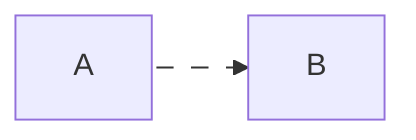

Breakdown:

- `e1@-->` creates an edge with ID `e1`.
- `classDef animate` defines a class named `animate` with styling and animation properties.
- `class e1 animate` applies the `animate` class to the edge `e1`.

**Note on Escaping Commas:** When setting the `stroke-dasharray` property, remember to escape commas as `\,` since commas are used as delimiters in Mermaid's style definitions.

## Circle Edge

An edge terminating with a circle (`o`) instead of an arrow.

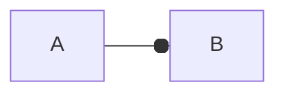

## Cross Edge

An edge terminating with a cross (`x`) instead of an arrow.

```mermaid
flowchart LR
    A --x B
```

## Multi-Directional Arrows

Arrows with markers on both ends.

```mermaid
flowchart LR
    A o--o B
    B <--> C
    C x--x D
```

- `o--o` : circle on both ends
- `<-->` : arrow on both ends
- `x--x` : cross on both ends

## Minimum Length of a Link

Each node in the flowchart is assigned to a rank in the rendered graph (a vertical or horizontal level depending on orientation). By default, links can span any number of ranks. To make a link longer, add extra dashes in the link definition.

**Example with extra dashes on the right side:**

```mermaid
flowchart TD
    A[Start] --> B{Is it?}
    B -->|Yes| C[OK]
    C --> D[Rethink]
    D --> B
    B ---->|No| E[End]
```

> **Note:** Links may still be made longer than the requested number of ranks by the rendering engine to accommodate other requests.

When the link label is written in the middle of the link, the extra dashes must be added on the right side of the link:

```mermaid
flowchart TD
    A[Start] --> B{Is it?}
    B -- Yes --> C[OK]
    C --> D[Rethink]
    D --> B
    B -- No ----> E[End]
```

## Link Length Table

For dotted or thick links, the characters to add are equals signs or dots. The following table shows the syntax for each link type at lengths 1, 2, and 3:

| Length            |   1    |    2    |    3     |
| ----------------- | :----: | :-----: | :------: |
| Normal            | `---`  | `----`  | `-----`  |
| Normal with arrow | `-->`  | `--->`  | `---->`  |
| Thick             | `===`  | `====`  | `=====`  |
| Thick with arrow  | `==>`  | `===>`  | `====>`  |
| Dotted            | `-.-`  | `-..-`  | `-...-`  |
| Dotted with arrow | `-.->` | `-..->` | `-...->` |

## See Also

- [Node Shapes](./node-shapes.md) — node shape syntaxes and the expanded shape catalog
- [Subgraphs and Layout](./subgraphs-and-layout.md) — grouping, direction, special characters
- [Styling and Configuration](./styling-and-config.md) — classDef, link styling, line curves, interactivity

## References

SOURCE: [Mermaid Flowchart Docs](https://github.com/mermaid-js/mermaid/blob/develop/packages/mermaid/src/docs/syntax/flowchart.md) (accessed 2026-03-07)
