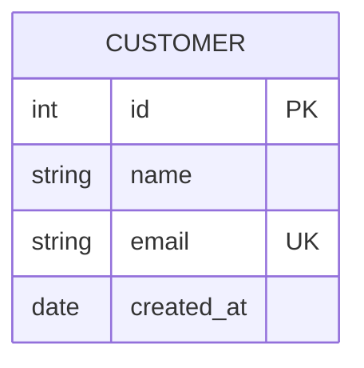
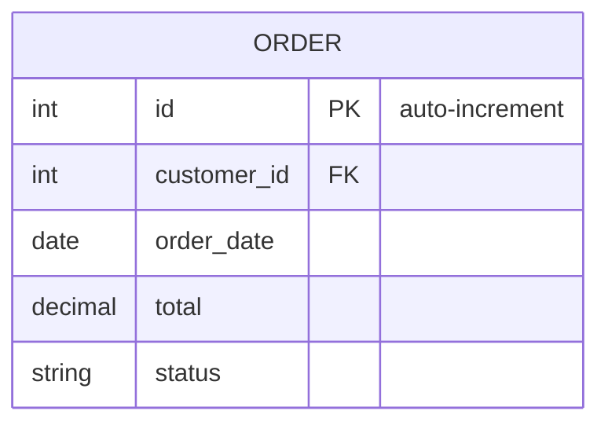
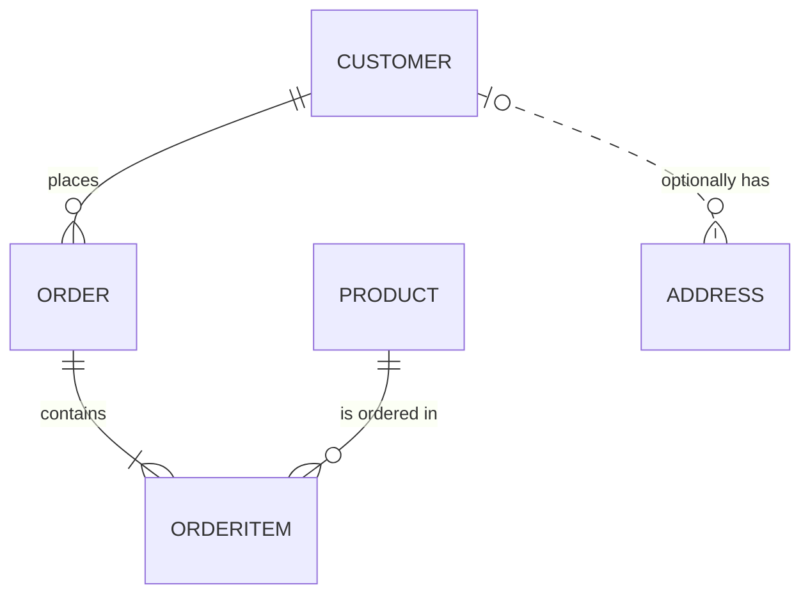
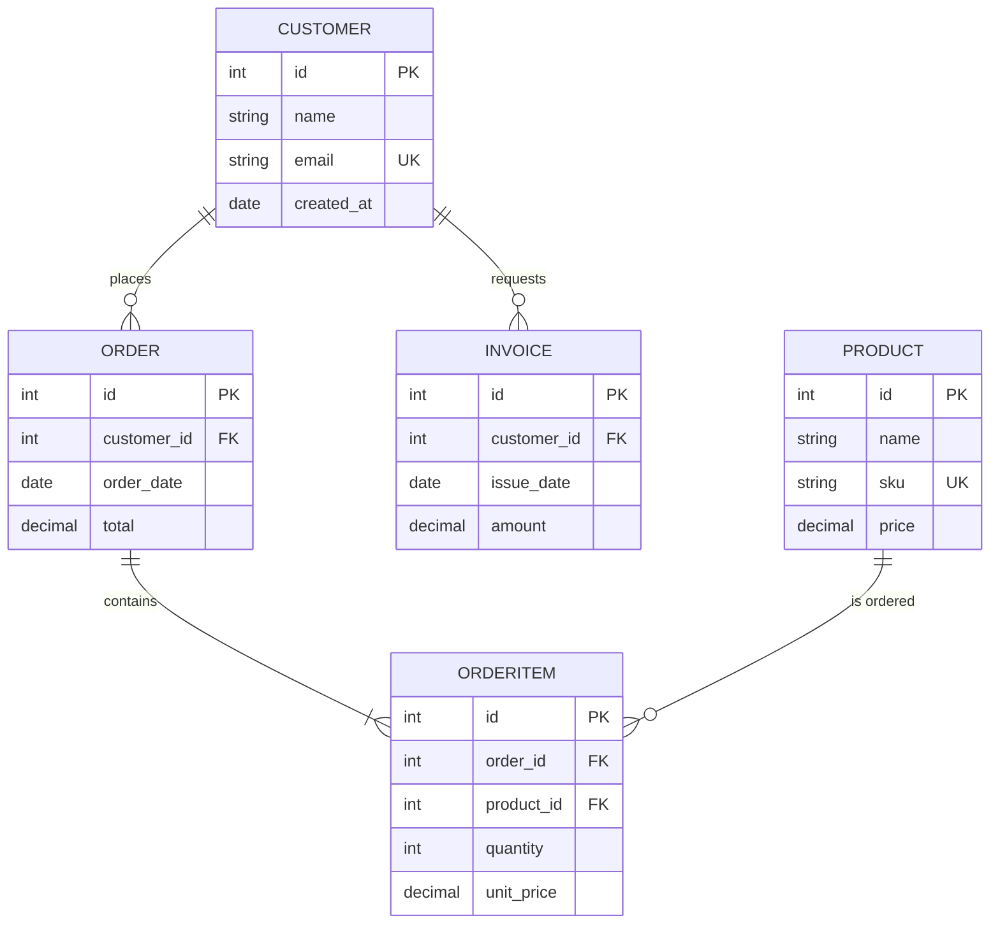
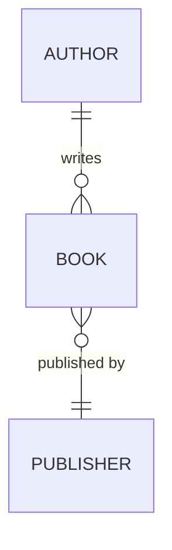

> Parent: [Mermaid Diagram Syntax](../SKILL.md)

# Entity Relationship Diagram

**Declaration**: `erDiagram`

## Entity Definition

Declare an entity and its attributes inside `{ }`. The entity name is uppercase by convention.



Entities without attributes can appear as bare names in relationship lines.

## Attribute Syntax

Each attribute line: `type name [PK|FK|UK] "optional comment"`



| Modifier | Meaning |
|----------|---------|
| `PK` | Primary Key |
| `FK` | Foreign Key |
| `UK` | Unique Key |

Modifiers are optional. Comments (quoted string) are optional.

## Relationship Syntax

```text
ENTITY_A <left-cardinality>--<right-cardinality> ENTITY_B : "label"
```

### Cardinality Symbols

| Symbol | Meaning |
|--------|---------|
| `\|o` | Zero or one (0..1) |
| `\|\|` | Exactly one (1) |
| `}o` | Zero or more (0..*) |
| `}\|` | One or more (1..*) |

Left side applies to ENTITY_A; right side applies to ENTITY_B.

### Line Types

| Syntax | Line | Meaning |
|--------|------|---------|
| `--` | Solid | Identifying relationship (child cannot exist without parent) |
| `..` | Dashed | Non-identifying relationship (child can exist independently) |

### Relationship Examples



Reading `CUSTOMER ||--o{ ORDER : places`:

- One and only one CUSTOMER places zero or more ORDERS
- Solid line — ORDER identity depends on CUSTOMER

## Complete Example



## Direction (v11+)

Control diagram layout with `direction` at the top of the block.



Valid values: `TB` (default), `BT`, `LR`, `RL`.

## v11+ Features

- `direction` keyword for layout control (replaces config-level workarounds)
- Attribute comments (quoted string as fourth token per attribute line)
- Multi-word entity names supported when quoted

## See Also

- [Flowchart Syntax](../SKILL.md)
- [Class Diagram](./class-diagram.md)
- [State Diagram](./state-diagram.md)
