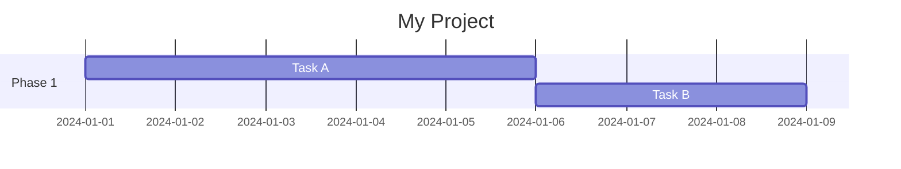
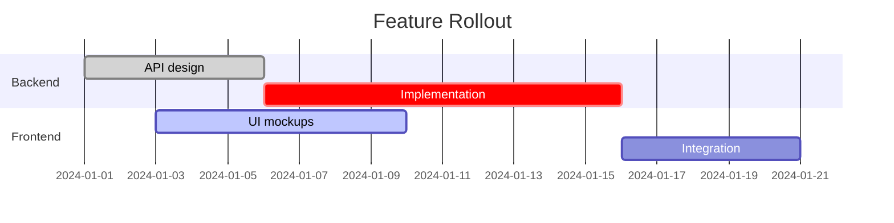
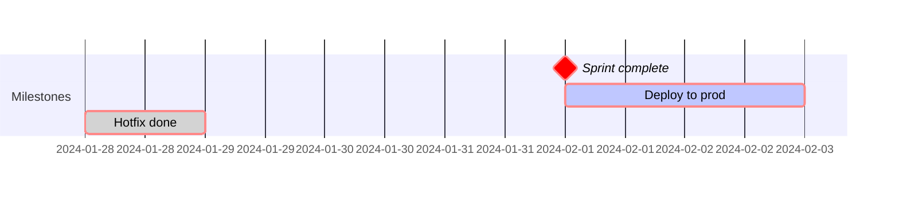
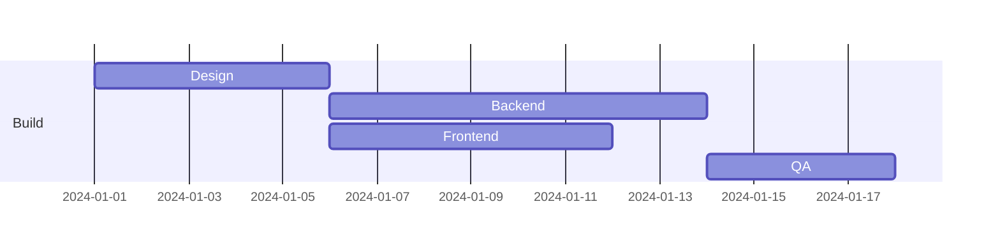
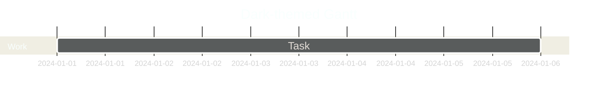
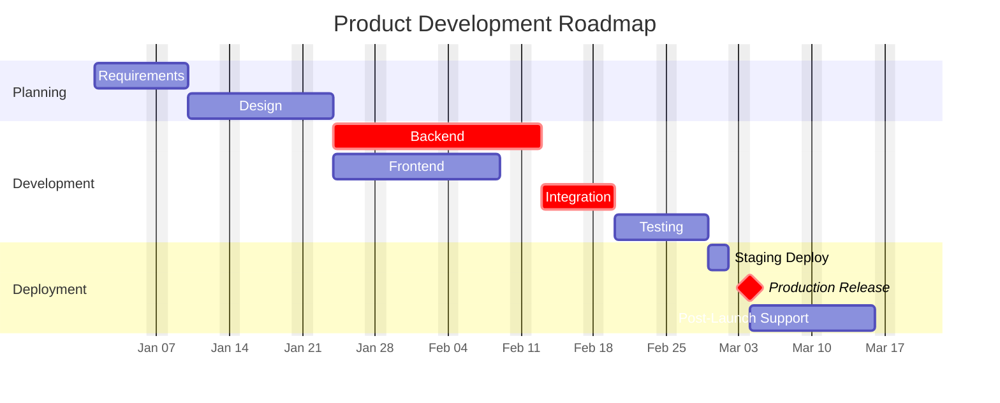

> Parent: [Mermaid Diagram Syntax](../SKILL.md)

# Gantt Chart

**Declaration**: `gantt`

SOURCE: Official Mermaid.js documentation (<https://mermaid.js.org/syntax/gantt.html>) (accessed 2026-03-07)

---

## Minimal Structure



---

## Configuration Directives

Place these at the top of the chart, before any sections:

```mermaid
gantt
    title         Project Title
    dateFormat    YYYY-MM-DD
    axisFormat    %b %d
    tickInterval  1week
    todayMarker   on
    excludes      weekends
    includes      2024-01-01,2024-12-25
```

| Directive     | Purpose                                              | Example value          |
|---------------|------------------------------------------------------|------------------------|
| `title`       | Chart heading                                        | `Sprint 4`             |
| `dateFormat`  | Input date parsing format                            | `YYYY-MM-DD`           |
| `axisFormat`  | Axis label display format (strftime tokens)          | `%m/%d`                |
| `tickInterval` | Axis tick spacing                                   | `1day`, `1week`, `1month` |
| `todayMarker` | Show/hide the "today" vertical line                  | `on` (default) / `off` |
| `excludes`    | Dates or keywords to skip (tasks stretch around them) | `weekends`, `2024-01-01` |
| `includes`    | Override excludes — force specific dates back in     | `2024-12-26`           |

---

## Sections and Tasks



Task syntax:

```text
<label> :<status>, <id>, <start>, <duration>
<label> :<status>, <id>, after <otherId>, <duration>
```

All fields after the first `:` are optional and order-insensitive within a slot — but the common convention is `status, id, start/after, duration`.

---

## Task Status Tags

```text
active      Currently in progress — highlighted in blue
done        Completed — greyed out
crit        Critical path — highlighted in red
milestone   Zero-duration marker — diamond shape (use 0d duration)
```

Tags combine:



---

## Task Dependencies

Use `after <id>` to chain tasks. Multiple dependencies use `after <id1> <id2>`:



`after be fe` means QA starts only after both Backend and Frontend complete.

---

## Date Formats

**Input date tokens** (used in `dateFormat`):

| Token | Meaning        |
|-------|----------------|
| `YYYY` | 4-digit year  |
| `MM`   | 2-digit month |
| `DD`   | 2-digit day   |

**Axis display tokens** (used in `axisFormat`, strftime-style):

| Token | Output          |
|-------|-----------------|
| `%Y`  | 4-digit year    |
| `%m`  | 2-digit month   |
| `%d`  | 2-digit day     |
| `%b`  | Abbreviated month name (Jan, Feb…) |
| `%j`  | Day of year     |

**Duration units**: `d` (days), `w` (weeks), `h` (hours), `m` (minutes), `s` (seconds).

---

## v11+ Features

Mermaid v11 (v11.12.3+ as of 2026-03-07) did not introduce Gantt-specific new syntax; however, the global `%%{init: {...}}%%` front-matter configuration applies to Gantt charts and enables theme and config overrides at render time:



Supported `gantt` config keys via `%%{init}%%`:

```text
barHeight           Height of each task bar in pixels
barGap              Gap between bars
topPadding          Space above first bar
rightPadding        Right margin
leftPadding         Left margin
gridLineStartPadding  Grid line offset
fontSize            Text size
fontFamily          Font face
numberSectionStyles Number of alternating section color styles (1-4)
axisFormat          Overrides directive-level axisFormat
```

---

## Complete Example



---

## See Also

- [Flowchart Syntax](../SKILL.md)
- [Timeline & Journey](./timeline-journey.md)
