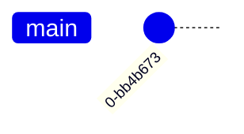
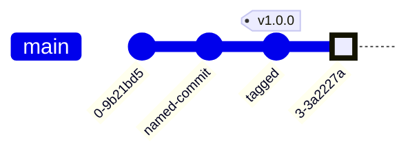
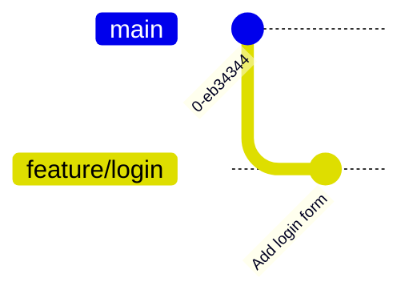
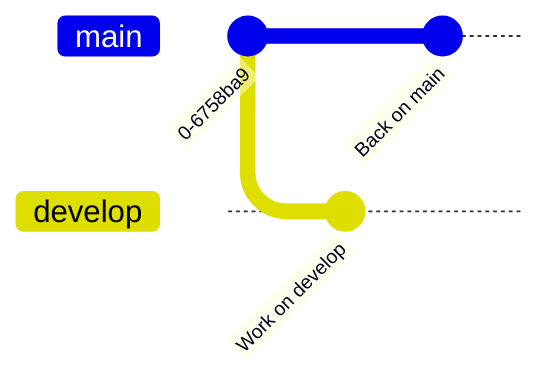
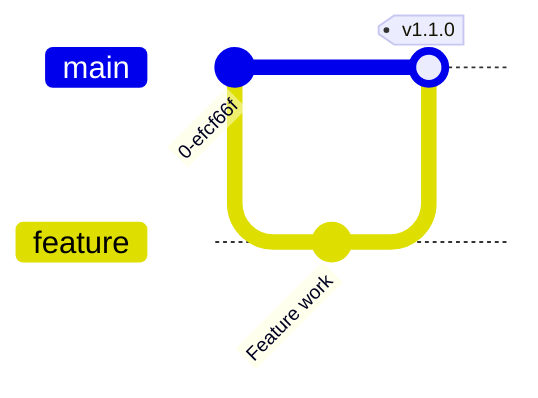
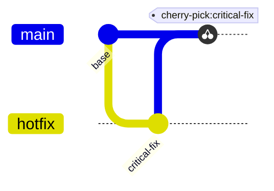
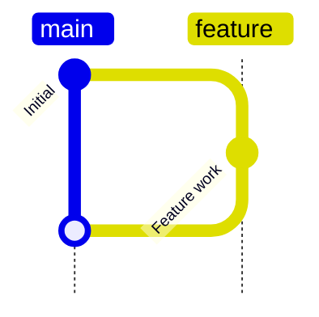
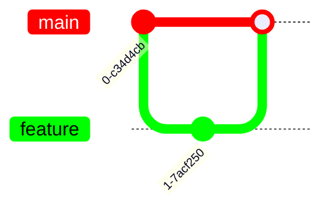
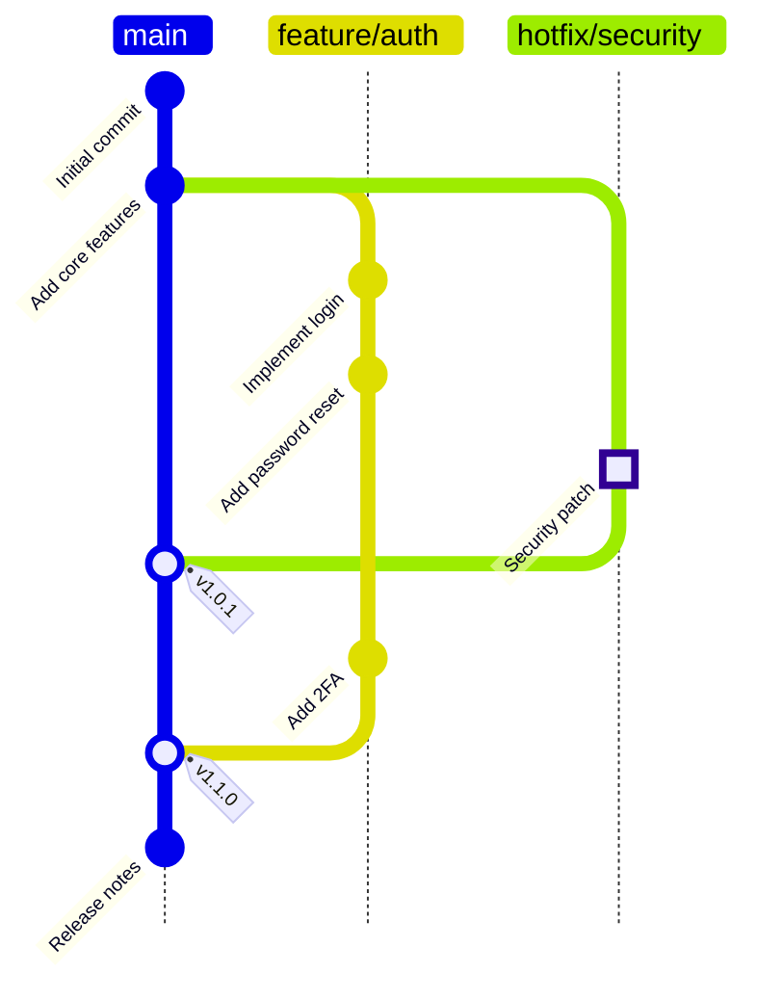

> Parent: [Mermaid Diagram Syntax](../SKILL.md)

# Git Graph

Visualizes Git branching history — commits, branches, merges, and cherry-picks.

## Declaration

Orientation is specified on the declaration line. Supported values:

- `LR` — left-to-right (default)
- `TB` — top-to-bottom
- `BT` — bottom-to-top

## Commands

### commit

Creates a commit on the current branch.

Options:

| Option | Values | Effect |
|--------|--------|--------|
| `id` | string | Sets commit label |
| `tag` | string | Attaches version tag |
| `type` | `NORMAL`, `REVERSE`, `HIGHLIGHT` | Changes commit marker shape |

Commit type markers:

- `NORMAL` — open circle (default)
- `REVERSE` — crossed circle
- `HIGHLIGHT` — filled rectangle

### branch

Creates a new branch at the current HEAD position.

### checkout

Switches the active branch. Subsequent `commit` calls land on this branch.

### merge

Merges a named branch into the current branch.

### cherry-pick

Applies a specific commit (by id) onto the current branch.

## Branch Ordering

Branches render in the order they are declared. Use `mainBranchOrder` to control position of the main branch among others.

## Direction

`TB` is useful when branch names are long or when embedding in narrow layouts.

## Theme Variables for Colors

Branch colors cycle through theme variables. Override in a `%%{init}%%` block:

Variables `git0` through `git7` map to branch colors in declaration order.

## Configuration Options

Passed via `%%{init}%%` under `'gitGraph'`:

| Option | Default | Effect |
|--------|---------|--------|
| `showBranches` | `true` | Show/hide branch lane labels |
| `showCommitLabel` | `true` | Show/hide commit id text |
| `mainBranchName` | `"main"` | Name of the primary branch |
| `mainBranchOrder` | `0` | Vertical position of main branch |
| `parallelCommits` | `false` | Align concurrent commits on same vertical line |

## v11+ Features

- `BT` orientation support added in v11
- `cherry-pick` command stabilized in v11
- Theme variable override via `%%{init}%%` fully supported in v11

## Complete Example

## See Also

- [Flowchart Syntax](../SKILL.md)
- [Timeline & Journey](./timeline-journey.md)
