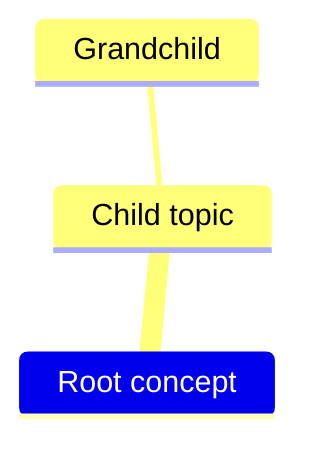
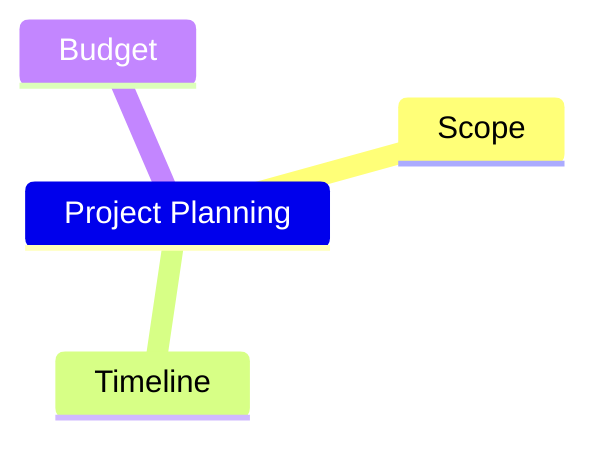
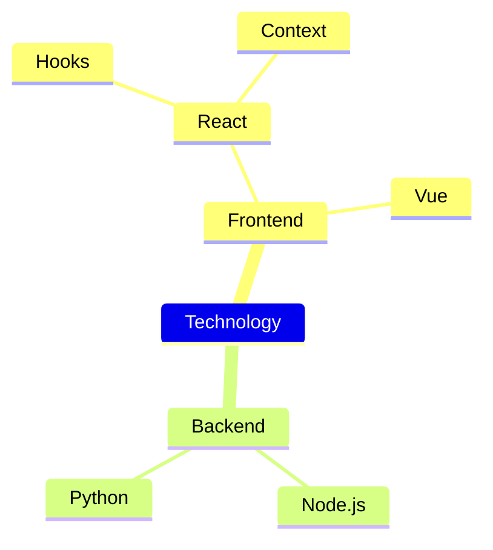
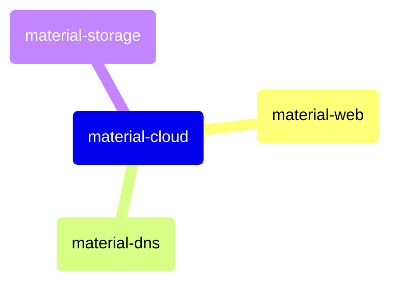
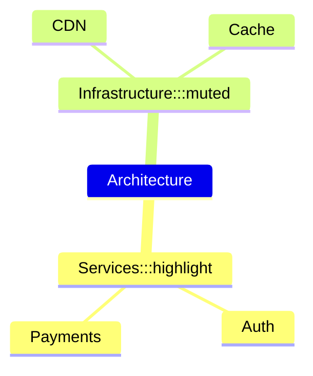
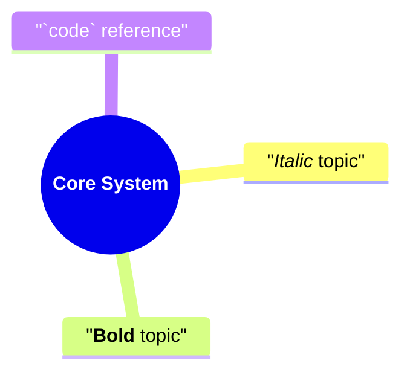
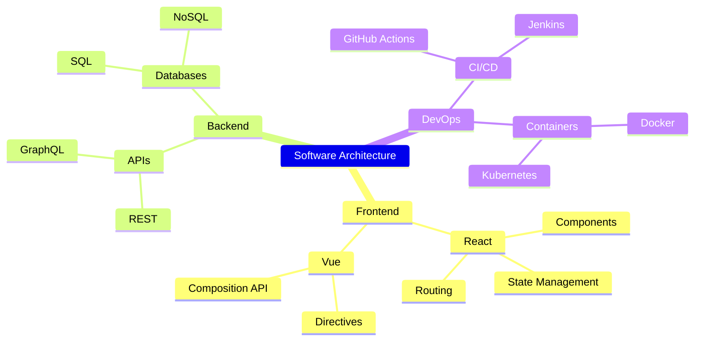

> Parent: [Mermaid Diagram Syntax](../SKILL.md)

# Mindmap

Renders hierarchical topic trees. Hierarchy is expressed entirely through indentation — no edge syntax required.

## Declaration



The keyword `mindmap` opens the diagram. Every subsequent line is a node, indented relative to its parent.

## Root Node

The root is the first indented item after `mindmap`. It is required and must be unique — the entire tree descends from it.



## Node Shapes

Shape is determined by the delimiters wrapping the node label.

| Shape | Syntax | Example |
|-------|--------|---------|
| Default (ellipse) | bare text | `Root` |
| Square | `[label]` | `[Milestone]` |
| Rounded rectangle | `(label)` | `(Goal)` |
| Circle | `((label))` | `((Core))` |
| Bang | `!(label)!` | `!(Alert)!` |
| Cloud | `))(label)((` | `))(Idea)((` |
| Hexagon | `{{label}}` | `{{Process}}` |

```mermaid
mindmap
    root((Central Idea))
        [Square node]
        (Rounded node)
        ((Circle node))
        !(Bang node)!
        ))(Cloud node)((
        {{Hexagon node}}
```

## Hierarchy via Indentation

Each level of indentation is one child level. Consistent spacing (2 or 4 spaces) is required within the diagram.



## Icons

Attach a Material icon to any node using `::icon(name)` after the label:



Icon names follow the Material Icons naming convention. The `::icon()` annotation is appended directly to the node text — no space before `::`.

## Classes

Apply a CSS class to a node using `:::className`:



Classes can be defined in a diagram-level `%%{init}%%` block or via an external stylesheet.

## Markdown Strings in Nodes

Node labels support inline Markdown formatting:



Wrap the label in double quotes to include Markdown syntax. Bold and italic apply within node rendering when the renderer supports it.

## v11+ Features

- Markdown string support in node labels stabilized in v11
- Icon rendering via `::icon()` fully supported in v11
- `%%{init}%%` theme variables apply to mindmap node fill and border colors in v11

## Complete Example



## See Also

- [Flowchart Syntax](../SKILL.md)
- [Timeline & Journey](./timeline-journey.md)
- [Block Diagram](./advanced-diagrams.md)
