> Parent: [Mermaid Diagram Syntax](../SKILL.md)

# Sequence Diagram Syntax

## Declaration

Every sequence diagram begins with `sequenceDiagram` on its own line.

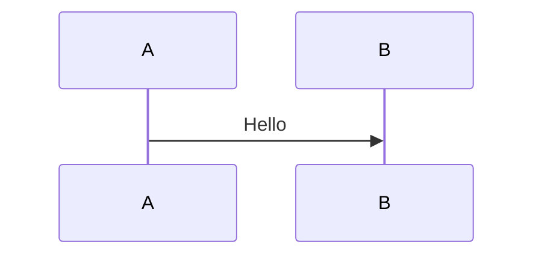

## Participants and Actors

Declare participants explicitly to control order. Use `actor` for human roles. Aliases shorten long names.

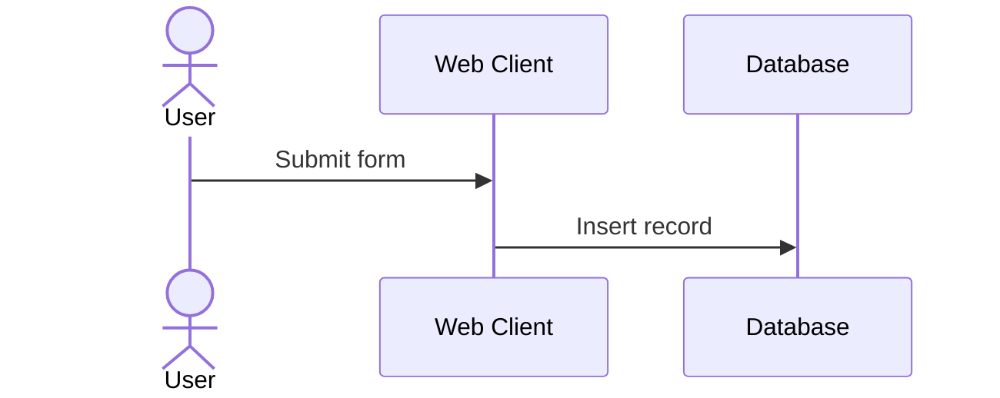

**Participant types** available in v11+: `boundary`, `control`, `entity`, `queue`, `collections` — render with UML stereotype icons.

## Message Types

| Syntax | Line | Arrowhead | Meaning |
|--------|------|-----------|---------|
| `A ->> B: msg` | Solid | Filled | Synchronous call |
| `A -->> B: msg` | Dotted | Filled | Reply / async response |
| `A -> B: msg` | Solid | Open | Solid open arrow |
| `A --> B: msg` | Dotted | Open | Dotted open arrow |
| `A -x B: msg` | Solid | Cross | Destroy / reject |
| `A --x B: msg` | Dotted | Cross | Dotted destroy |
| `A -) B: msg` | Solid | Async | Solid async (fire-and-forget) |
| `A --) B: msg` | Dotted | Async | Dotted async |
| `A ~>> B: msg` | Solid | Async thick | Solid thick async (v11+) |
| `A ~~>> B: msg` | Dotted | Async thick | Dotted thick async (v11+) |

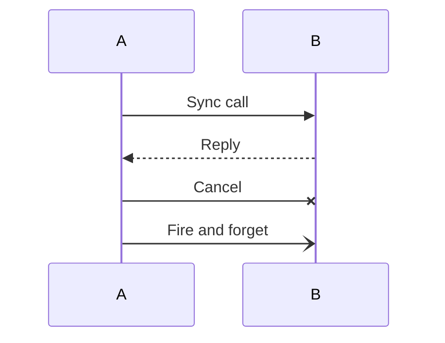

## Activation Boxes

Show a participant is active (processing) using `activate`/`deactivate` or the `+`/`-` shorthand on the message line.

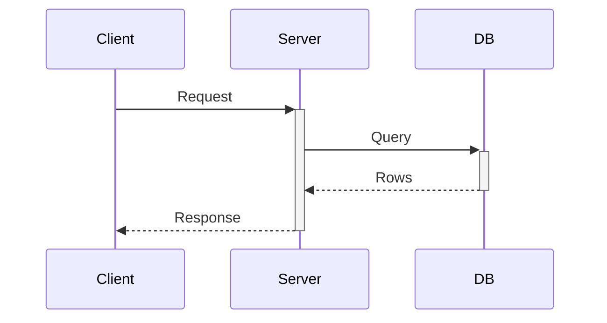

## Notes

Place notes to the left, right, or spanning multiple participants.

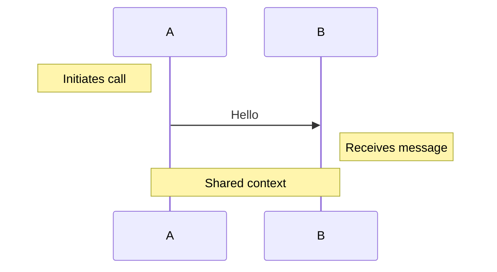

## Loops

Repeat a block of interactions.

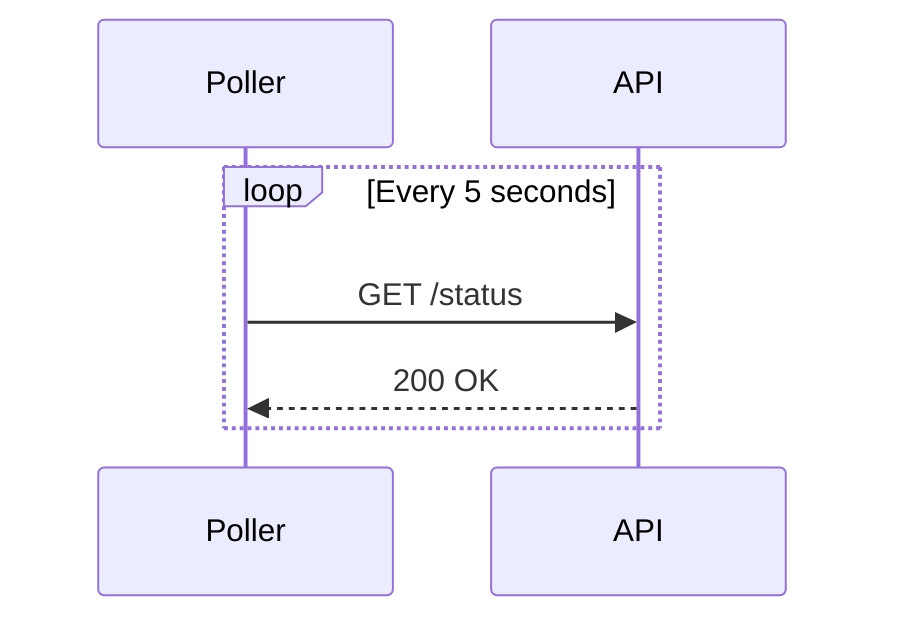

## Alt / Else (Conditional)

Model branching based on a condition.

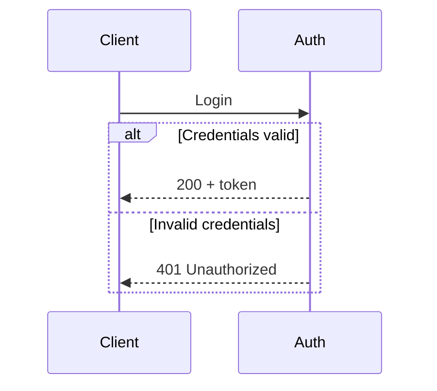

## Opt (Optional Fragment)

Show a block that executes only when a condition is met.

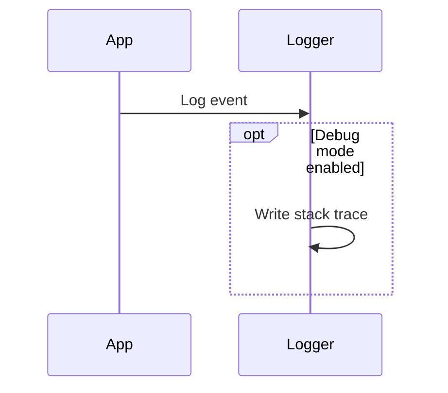

## Par (Parallel)

Show concurrent execution paths.

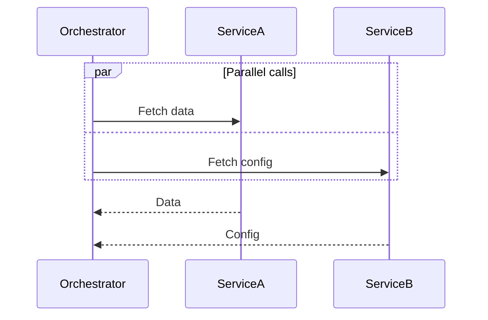

## Critical / Option

Model a critical section with a mandatory body and optional fallback paths.

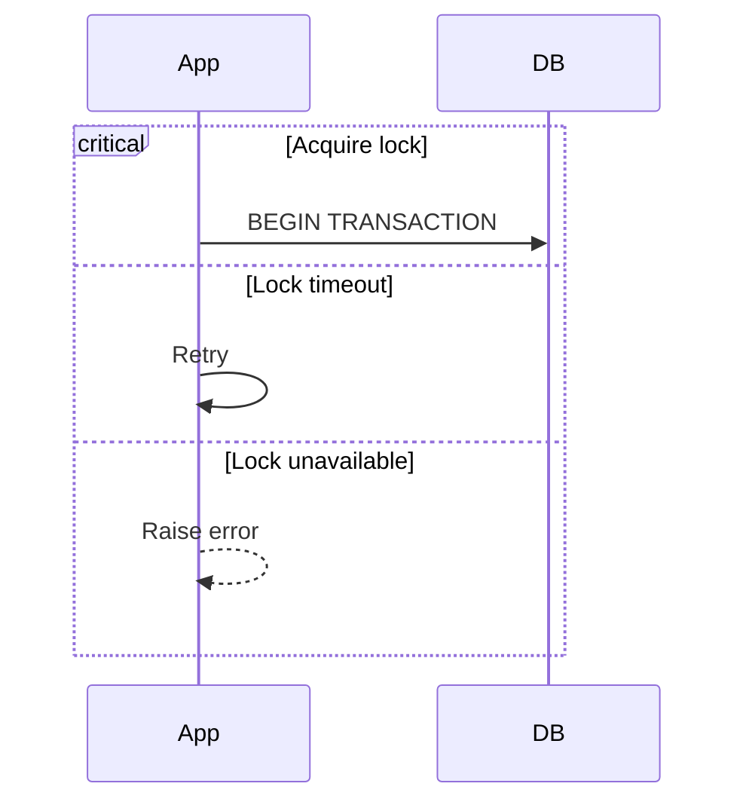

## Break

Exit a sequence early when a condition occurs.

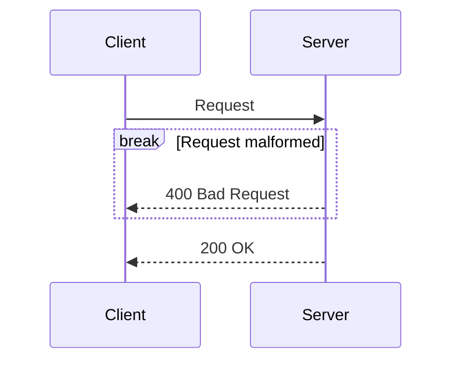

## Background Highlighting (rect)

Shade a region to group related interactions visually.

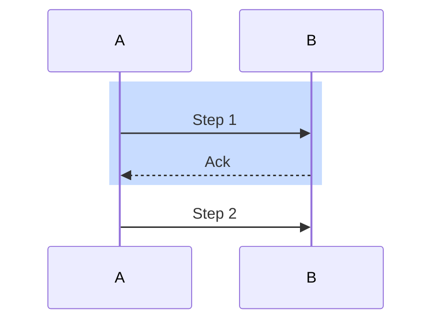

## Sequence Numbering (autonumber)

Add automatic step numbers to all messages. Supports offset and increment.

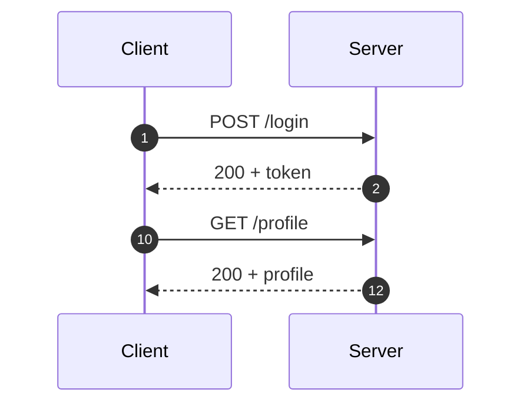

`autonumber` alone starts at 1 with increment 1. `autonumber <start> <step>` sets both.

## Links and Actor Menus

Attach clickable URLs to participants (renders as actor menu in supported renderers).

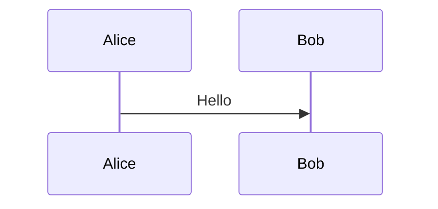

## v11+ Features

- `boundary`, `control`, `entity`, `queue`, `collections` participant types with UML icons
- Half-arrow message type: `A -| B: msg`
- Open back arrow: `A (- B: msg`
- Thick async arrows: `A ~>> B: msg` and `A ~~>> B: msg`

## Full Working Example

```mermaid
sequenceDiagram
    autonumber
    actor User
    participant Client as Web Client
    participant Server as API Server
    participant DB as Database

    User ->>+ Client: Click Submit
    Client ->>+ Server: POST /api/order

    critical Validate request
        Server ->> Server: Check schema
    option Invalid body
        Server -->> Client: 400 Bad Request
    end

    alt User authenticated
        Server ->>+ DB: INSERT order
        DB -->>- Server: order_id
        Server -->>- Client: 201 Created
    else Not authenticated
        Server -->>- Client: 401 Unauthorized
    end

    Client -->>- User: Show result

    note over Client,Server: All calls use TLS
```

## See Also

- [Flowchart Construction](./flowchart-construction.md)
- [Node Shapes](./node-shapes.md)
- [Edge Syntax](./edge-syntax.md)
- [Styling and Config](./styling-and-config.md)
- [Subgraphs and Layout](./subgraphs-and-layout.md)
