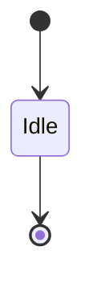
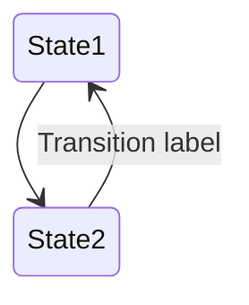
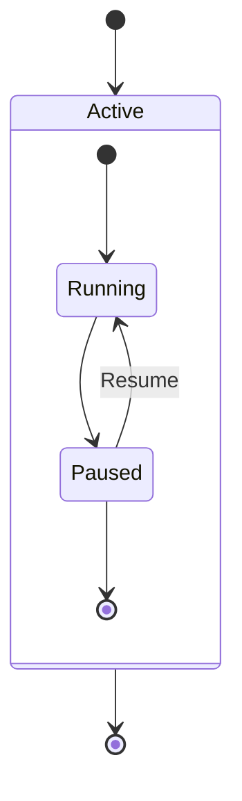
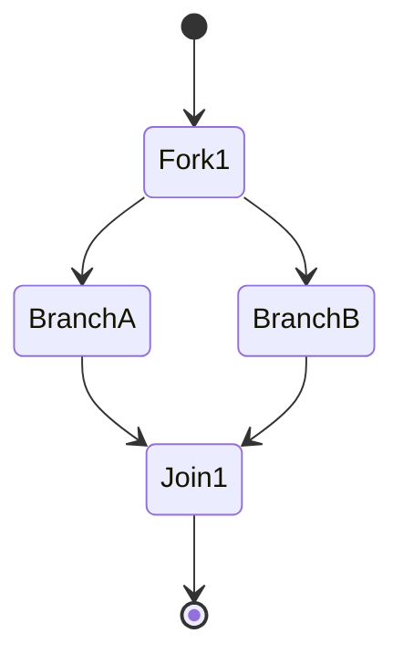
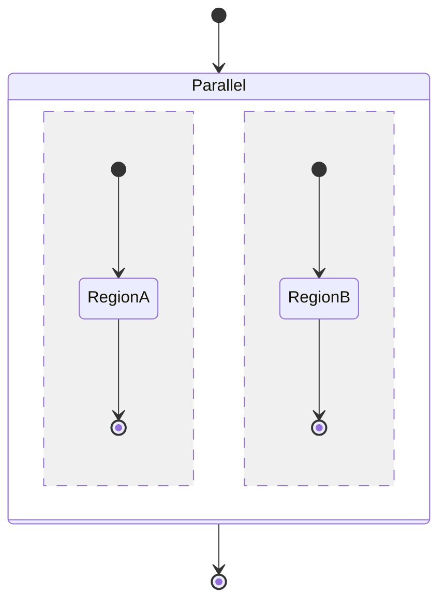
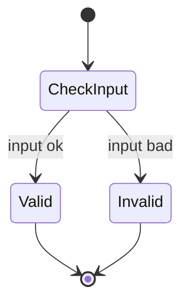
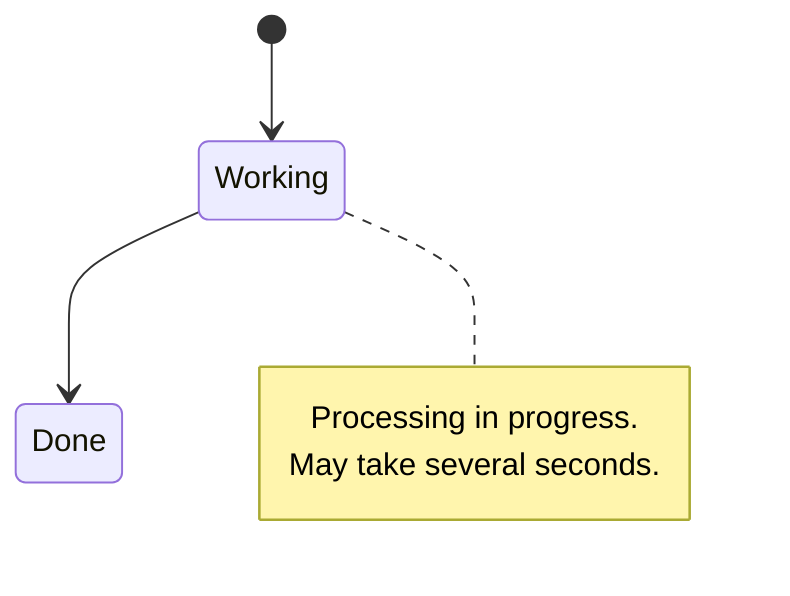
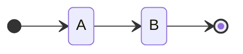
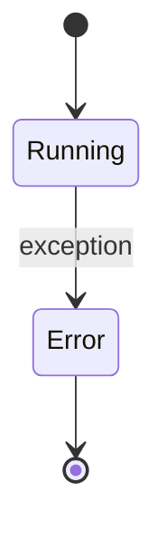
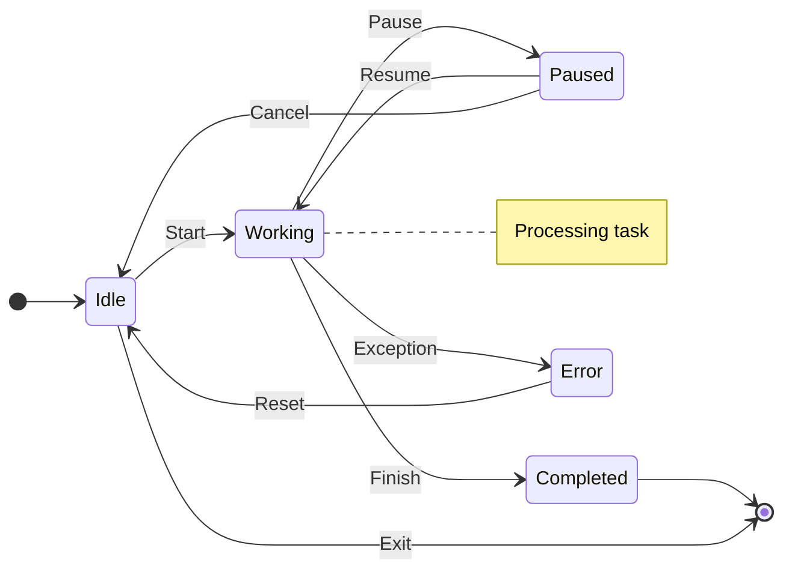

> Parent: [Mermaid Diagram Syntax](../SKILL.md)

# State Diagram

**Declaration**: `stateDiagram-v2` (preferred) or `stateDiagram` (v1, legacy)

Use `stateDiagram-v2` for all new diagrams — it supports composite states, concurrency, fork/join, and direction control that v1 lacks.

## Start and End States

`[*]` is the pseudo-state used for both start (initial) and end (final) depending on position.

## Simple States and Transitions

Transition labels follow the `:` separator. Labels are optional.

## Composite (Nested) States

Wrap child states in a `state Name { }` block.

Composite states can be nested to arbitrary depth.

## Fork and Join

Use `<<fork>>` to split into parallel paths and `<<join>>` to merge them.

## Concurrency

The `---` separator inside a composite state declares concurrent (parallel) regions.

Each region separated by `---` runs independently.

## Choice (Conditional Branch)

## Notes

Attach a note to any state using `note right of` or `note left of`.

## Direction

Control layout with the `direction` keyword. Place it at the top of the diagram or inside a composite state.

Valid values: `TB` (top-bottom, default), `BT`, `LR`, `RL`.

## v11+ Features

- `stateDiagram-v2` is fully supported in v11; `stateDiagram` (v1) remains available for legacy use
- Per-state styling via `classDef` and `:::` inline syntax
- Composite state direction overrides (each nested state can have its own `direction`)

## Complete Example

## See Also

- [Flowchart Syntax](../SKILL.md)
- [Class Diagram](./class-diagram.md)
- [ER Diagram](./er-diagram.md)
