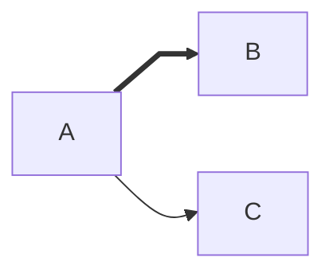
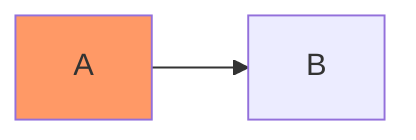
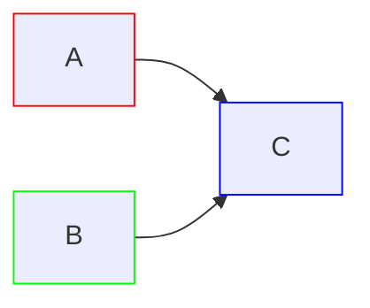
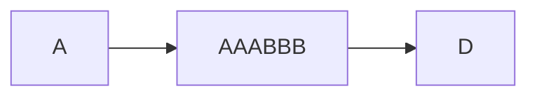
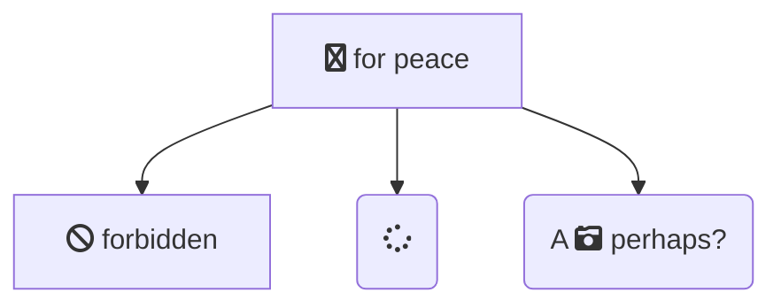

> Parent: [Mermaid Flowchart Syntax](../SKILL.md)

# Flowchart Styling, Interactivity, and Configuration

Reference for Mermaid flowchart interaction bindings, node/link styling, class definitions, FontAwesome icon integration, and renderer configuration. Covers all syntax forms, security constraints, and CSS property patterns.

## Table of Contents

- [Interaction](#interaction)
  - [Click Callback Syntax](#click-callback-syntax)
  - [Click Link Syntax](#click-link-syntax)
  - [Tooltips](#tooltips)
  - [Link Targets](#link-targets)
  - [Security Level Constraint](#security-level-constraint)
  - [Full Interactive Example](#full-interactive-example)
- [Styling Links](#styling-links)
  - [linkStyle by Index](#linkstyle-by-index)
  - [linkStyle Multiple Indices](#linkstyle-multiple-indices)
- [Styling Line Curves](#styling-line-curves)
  - [Available Curve Styles](#available-curve-styles)
  - [Diagram-Level Curve](#diagram-level-curve)
  - [Edge-Level Curve](#edge-level-curve)
- [Styling Nodes](#styling-nodes)
  - [Inline style Statement](#inline-style-statement)
  - [classDef Syntax](#classdef-syntax)
  - [Class Attachment](#class-attachment)
  - [Shorthand Class Operator](#shorthand-class-operator)
  - [Default Class](#default-class)
  - [CSS Classes (External Stylesheet)](#css-classes-external-stylesheet)
- [FontAwesome Icons](#fontawesome-icons)
  - [Icon Syntax](#icon-syntax)
  - [Supported Prefixes](#supported-prefixes)
  - [Custom Icons](#custom-icons)
- [Configuration](#configuration)
  - [Renderer](#renderer)
  - [Width](#width)
- [References](#references)

## Interaction

Flowchart nodes can bind click events to JavaScript callbacks or hyperlinks.

### Click Callback Syntax

Bind a node click to a JavaScript function defined on the hosting page. The function receives the `nodeId` as its parameter.

```text
click nodeId callback
click nodeId call callback()
```

- `callback` form: invokes the named function directly
- `call callback()` form: explicit call syntax (equivalent behavior)

### Click Link Syntax

Bind a node click to open a URL.

```text
click nodeId "https://www.github.com"
click nodeId href "https://www.github.com"
```

Both forms are equivalent. The `href` keyword is optional but explicit.

### Tooltips

Tooltip text is a double-quoted string placed after the URL or callback name.

```text
click A callback "Tooltip for a callback"
click B "https://www.github.com" "This is a tooltip for a link"
click C call callback() "Tooltip for a callback"
click D href "https://www.github.com" "This is a tooltip for a link"
```

Tooltip styles are controlled by the CSS class `.mermaidTooltip`.

### Link Targets

Links open in the same browser tab/window by default. Add a link target after the URL (or after the tooltip string) to change this behavior.

Supported target values:

| Target | Behavior |
|--------|----------|
| `_self` | Same frame (default) |
| `_blank` | New tab/window |
| `_parent` | Parent frame |
| `_top` | Full body of the window |

```text
click A "https://www.github.com" _blank
click B "https://www.github.com" "Open this in a new tab" _blank
click C href "https://www.github.com" _blank
click D href "https://www.github.com" "Open this in a new tab" _blank
```

### Security Level Constraint

**This functionality is disabled when using `securityLevel='strict'` and enabled when using `securityLevel='loose'`.**

To enable click interactions, the Mermaid configuration must set `securityLevel: 'loose'`.

### Full Interactive Example

Complete HTML page with callbacks, links, tooltips, and loose security level:

```html
<body>
  <pre class="mermaid">
    flowchart LR
        A-->B
        B-->C
        C-->D
        click A callback "Tooltip"
        click B "https://www.github.com" "This is a link"
        click C call callback() "Tooltip"
        click D href "https://www.github.com" "This is a link"
  </pre>

  <script>
    window.callback = function () {
      alert('A callback was triggered');
    };
    const config = {
      startOnLoad: true,
      htmlLabels: true,
      flowchart: { useMaxWidth: true, curve: 'cardinal' },
      securityLevel: 'loose',
    };
    mermaid.initialize(config);
  </script>
</body>
```

## Styling Links

Links (edges) have no IDs in the same way as nodes. Style them by their zero-based definition order, or use `default` to apply to all links.

### linkStyle by Index

Style the fourth link (index 3) in the graph:

```text
linkStyle 3 stroke:#ff3,stroke-width:4px,color:red;
```

### linkStyle Multiple Indices

Style multiple links in a single statement by separating indices with commas:

```text
linkStyle 1,2,7 color:blue;
```

## Styling Line Curves

### Available Curve Styles

The complete enumeration of supported curve styles:

| Curve | Description |
|-------|-------------|
| `basis` | B-spline basis curve |
| `bumpX` | Bump curve with vertical tangents |
| `bumpY` | Bump curve with horizontal tangents |
| `cardinal` | Cardinal spline curve |
| `catmullRom` | Catmull-Rom spline curve |
| `linear` | Straight line segments |
| `monotoneX` | Monotone cubic interpolation (preserves monotonicity in x) |
| `monotoneY` | Monotone cubic interpolation (preserves monotonicity in y) |
| `natural` | Natural cubic spline |
| `step` | Step function (midpoint transition) |
| `stepAfter` | Step function (transition after data point) |
| `stepBefore` | Step function (transition before data point) |

SOURCE: [d3-shape curves documentation](https://d3js.org/d3-shape/curve) for the full list including custom curve explanations.

### Diagram-Level Curve

Set the curve style for all edges in the diagram via YAML front matter config:

```yaml
---
config:
  flowchart:
    curve: stepBefore
---
graph LR
```

### Edge-Level Curve

Available since v11.10.0. Assign an ID to an edge, then modify its `curve` property.



Rules:

- Edge-level curve overrides the diagram-level curve style.
- If the same edge is modified multiple times, the last modification is rendered.

## Styling Nodes

### Inline style Statement

Apply CSS properties directly to a node by ID:

```text
style id1 fill:#f9f,stroke:#333,stroke-width:4px
style id2 fill:#bbf,stroke:#f66,stroke-width:2px,color:#fff,stroke-dasharray: 5 5
```

### classDef Syntax

Define a reusable class of styles:

```text
classDef className fill:#f9f,stroke:#333,stroke-width:4px;
```

Define styles for multiple classes in one statement:

```text
classDef firstClassName,secondClassName font-size:12pt;
```

### Class Attachment

Attach a class to one or more nodes:

```text
class nodeId1 className;
class nodeId1,nodeId2 className;
```

### Shorthand Class Operator

Use the `:::` operator to attach a class inline with node declaration:



The shorthand works in multi-link declarations:



### Default Class

A class named `default` is automatically assigned to all nodes that lack a specific class definition:

```text
classDef default fill:#f9f,stroke:#333,stroke-width:4px;
```

### CSS Classes (External Stylesheet)

Define styles in an external CSS stylesheet and reference them from the graph.

CSS definition:

```html
<style>
  .cssClass > rect {
    fill: #ff0000;
    stroke: #ffff00;
    stroke-width: 4px;
  }
</style>
```

Graph usage:



The CSS selector `.cssClass > rect` targets the SVG `<rect>` element inside nodes with the applied class.

## FontAwesome Icons

### Icon Syntax

Icons are embedded in node labels using the `fa:` prefix followed by the icon class name:

```text
fa:fa-icon-name
```



Icons can appear anywhere within node label text, mixed with other text.

### Supported Prefixes

Icon packs can be registered (v11.7.0+) using these prefixes:

| Prefix | Icon Set |
|--------|----------|
| `fa` | FontAwesome (generic) |
| `fab` | FontAwesome Brands |
| `fas` | FontAwesome Solid |
| `far` | FontAwesome Regular |
| `fal` | FontAwesome Light |
| `fad` | FontAwesome Duotone |

If FontAwesome icon packs are not registered, Mermaid falls back to FontAwesome CSS.

### Custom Icons

Custom icons from Font Awesome kits (paid feature) use the `fak` prefix:

```text
fak:fa-custom-icon-name
```

```text
flowchart TD
    B[fa:fa-twitter] %% standard icon
    B-->E(fak:fa-custom-icon-name) %% custom icon
```

The hosting website must import the corresponding Font Awesome kit for custom icons to render.

## Configuration

### Renderer

The default renderer is **dagre**.

Starting with Mermaid v9.4, an alternate renderer named **elk** is available. The elk renderer is better for larger and/or more complex diagrams. It is an experimental feature.

Switch to elk via directive:

```yaml
config:
  flowchart:
    defaultRenderer: "elk"
```

The site must use Mermaid v9.4+ and have the elk feature enabled in the lazy-loading configuration.

### Width

Adjust the rendered flowchart width via `mermaid.flowchartConfig`:

```javascript
mermaid.flowchartConfig = {
    width: 100%
}
```

`mermaid.flowchartConfig` can be set to a JSON string with config parameters or the corresponding object. The CLI also accepts a JSON file with the configuration.

## References

[1] [Mermaid Flowchart Docs](https://github.com/mermaid-js/mermaid/blob/develop/packages/mermaid/src/docs/syntax/flowchart.md) (accessed 2026-03-07)

[2] [d3-shape Curves](https://d3js.org/d3-shape/curve) (accessed 2026-03-07) -- curve style enumeration source

[3] [Font Awesome Official Documentation](https://fontawesome.com/start) (accessed 2026-03-07)

## See Also

- [Node Shapes](./node-shapes.md) — node shape syntaxes and the expanded shape catalog
- [Edge Syntax](./edge-syntax.md) — link types, arrows, chaining, edge IDs, animations
- [Subgraphs and Layout](./subgraphs-and-layout.md) — grouping, direction, special characters
