> Parent: [Mermaid Flowchart Syntax](../SKILL.md)

# Subgraphs, Layout, Special Characters, Markdown Strings, and Comments

Reference for Mermaid flowchart features covering graph direction, subgraph grouping and nesting, special character escaping, markdown-formatted labels, and comment syntax. These features control the visual layout and text rendering of flowchart diagrams.

## Table of Contents

- [Direction Declarations](#direction-declarations)
- [Subgraphs](#subgraphs)
- [Subgraph with Explicit ID](#subgraph-with-explicit-id)
- [Edges to and from Subgraphs](#edges-to-and-from-subgraphs)
- [Direction in Subgraphs](#direction-in-subgraphs)
- [Subgraph Direction Limitation](#subgraph-direction-limitation)
- [Special Characters](#special-characters)
- [Entity Codes](#entity-codes)
- [Markdown Strings](#markdown-strings)
- [Comments](#comments)
- [Constraints](#constraints)

## Direction Declarations

The direction statement on the first line after `flowchart` declares the overall orientation of the graph.

| Declaration | Meaning |
|-------------|---------|
| `TB` | Top to bottom |
| `TD` | Top-down (same as top to bottom) |
| `BT` | Bottom to top |
| `RL` | Right to left |
| `LR` | Left to right |

Top-to-bottom example:

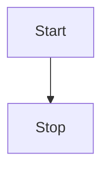

Left-to-right example:

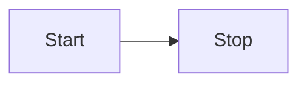

## Subgraphs

A subgraph groups nodes inside a labeled box. Syntax:

```text
subgraph title
    graph definition
end
```

The `title` becomes both the visible label and the subgraph ID (used for referencing in edges).

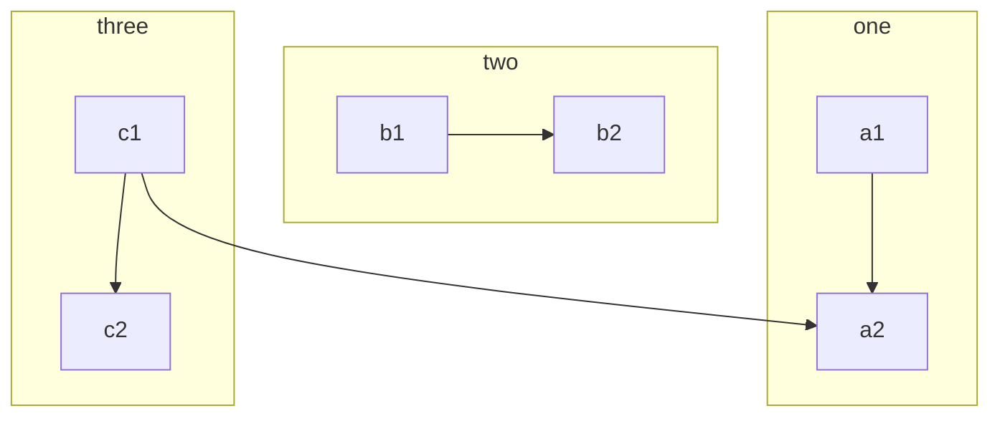

## Subgraph with Explicit ID

To set an ID that differs from the displayed label, use `subgraph id [label]` syntax:

```text
subgraph ide1 [one]
    graph definition
end
```

Here `ide1` is the ID (used in edges) and `one` is the displayed label.

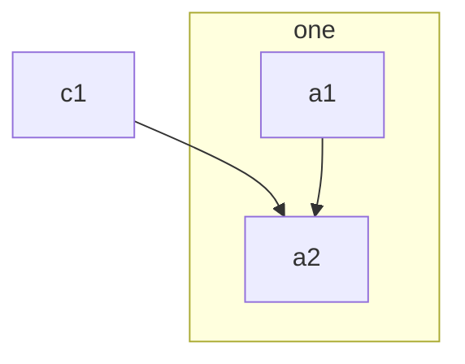

## Edges to and from Subgraphs

With the `flowchart` graph type (not `graph`), edges can connect to subgraph IDs directly. Use the subgraph title or explicit ID as the edge endpoint:

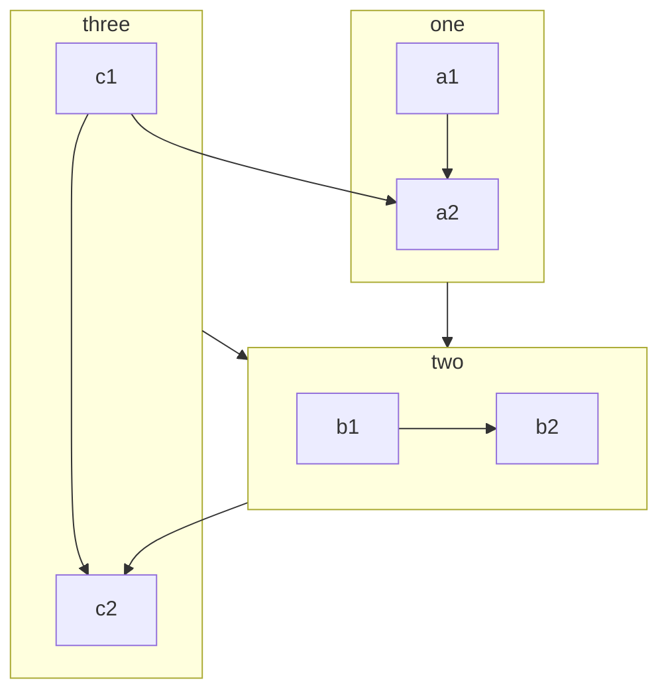

## Direction in Subgraphs

Each subgraph can declare its own `direction` statement, overriding the parent graph's orientation. Place `direction TB|TD|BT|RL|LR` as the first statement inside the subgraph:

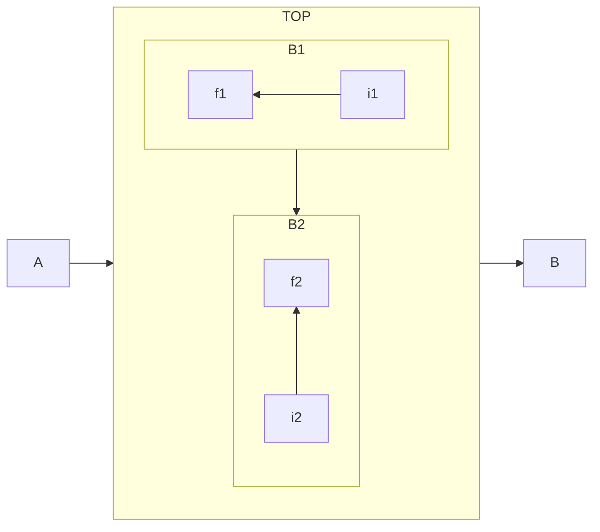

## Subgraph Direction Limitation

**TYPE: constraint** -- If any of a subgraph's nodes are linked to the outside, the subgraph direction will be ignored. Instead the subgraph will inherit the direction of the parent graph.

This means: linking to the subgraph ID itself preserves the subgraph's declared direction, but linking directly to a node inside the subgraph causes that subgraph to lose its own direction.

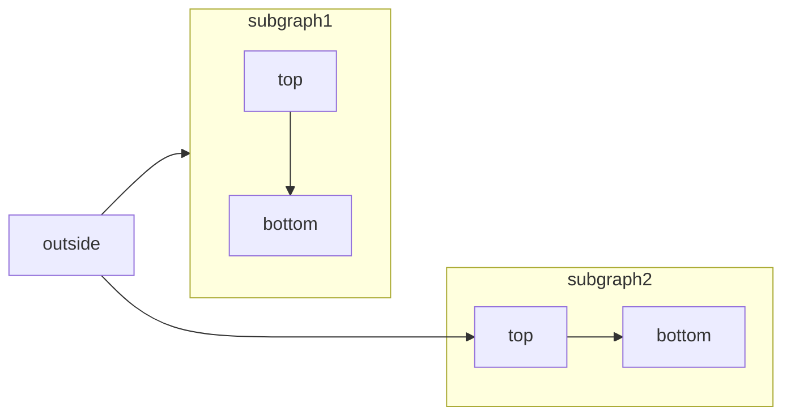

In this example, `subgraph1` keeps its `TB` direction because the external link targets the subgraph ID. `subgraph2` loses its `TB` direction and inherits `LR` from the parent because the external link targets `top2`, a node inside the subgraph.

## Special Characters

Characters that break Mermaid syntax (parentheses, brackets, etc.) can be escaped by wrapping the entire label text in double quotes:

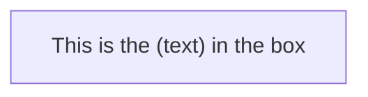

## Entity Codes

Use the `#entity;` syntax to insert characters that cannot appear directly in labels. The number is a base-10 Unicode code point, or an HTML character name:

| Entity Code | Result |
|-------------|--------|
| `#quot;` | `"` (double quote) |
| `#9829;` | Heart symbol |
| `#35;` | `#` (hash/pound) |

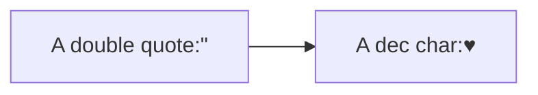

Numbers given are base 10, so `#` can be encoded as `#35;`. HTML character names are also supported.

## Markdown Strings

Markdown strings use the `` "`text`" `` syntax (double quote, backtick, content, backtick, double quote) to enable rich text formatting inside labels:

- **Bold**: `**text**`
- **Italics**: `*text*`
- **Auto-wrap**: Text wraps automatically; use literal newlines instead of `<br>` tags
- **Applies to**: Node labels, edge labels, and subgraph labels

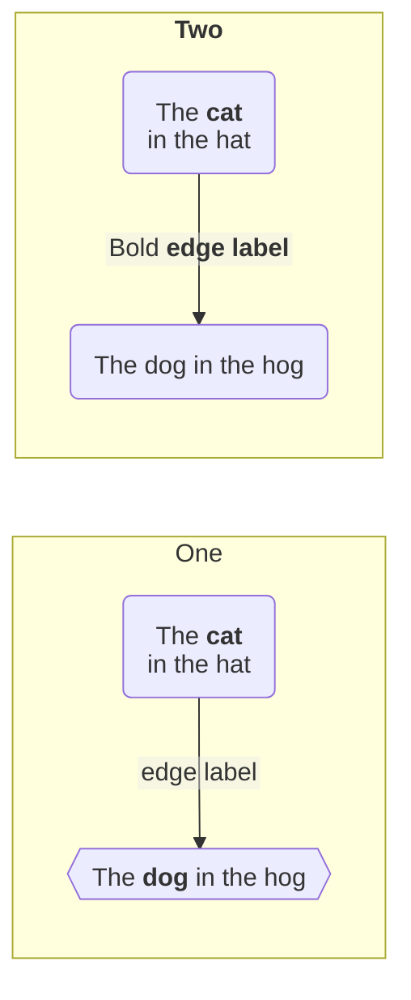

### markdownAutoWrap Config

Auto-wrapping of markdown strings can be disabled via configuration:

```mermaid
---
config:
  markdownAutoWrap: false
---
graph LR
```

When `markdownAutoWrap` is `false`, text will not wrap automatically and newlines must be explicit.

## Comments

Comments use `%%` (double percent signs). They must be on their own line. All text from `%%` to the end of that line is ignored by the parser:

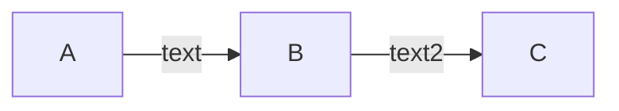

The comment on line 2 is completely ignored. The flow syntax within the comment (`A -- text --> B{node}`) does not create any nodes or edges.

## Constraints

### The "end" Keyword

**TYPE: constraint** -- The word `end` in all lowercase is reserved syntax that closes subgraphs. If a flowchart node needs the text "end", capitalize the entire word or any letter (e.g., `"End"` or `"END"`). Typing `end` in all lowercase as node text will break the flowchart. Workaround: [mermaid-js/mermaid#1444](https://github.com/mermaid-js/mermaid/issues/1444#issuecomment-639528897).

### The "o" and "x" First-Letter Warning

**TYPE: constraint** -- If the letter `o` or `x` is the first character of a connecting flowchart node name, it will be interpreted as edge syntax rather than a node name:

- `A---oB` creates a circle edge (not a node named `oB`)
- `A---xB` creates a cross edge (not a node named `xB`)

To avoid this, add a space before the letter or capitalize it (e.g., `dev--- ops` or `dev---Ops`).

## See Also

- [Node Shapes](./node-shapes.md) — node shape syntaxes and the expanded shape catalog
- [Edge Syntax](./edge-syntax.md) — link types, arrows, chaining, edge IDs, animations
- [Styling and Configuration](./styling-and-config.md) — classDef, CSS classes, interactivity

## References

SOURCE: [Mermaid Flowchart Docs](https://github.com/mermaid-js/mermaid/blob/develop/packages/mermaid/src/docs/syntax/flowchart.md) (accessed 2026-03-07)
