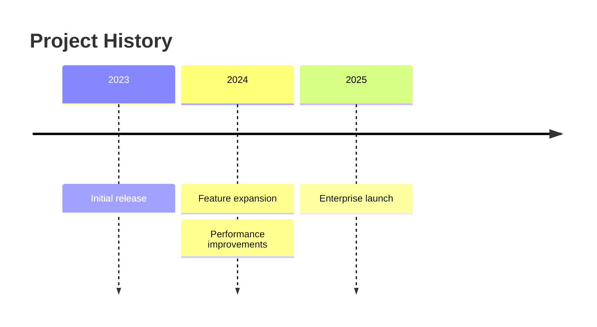
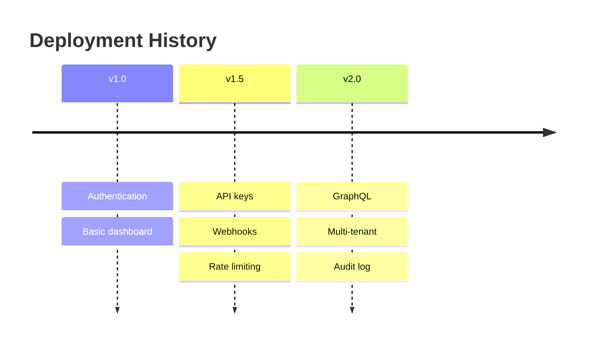
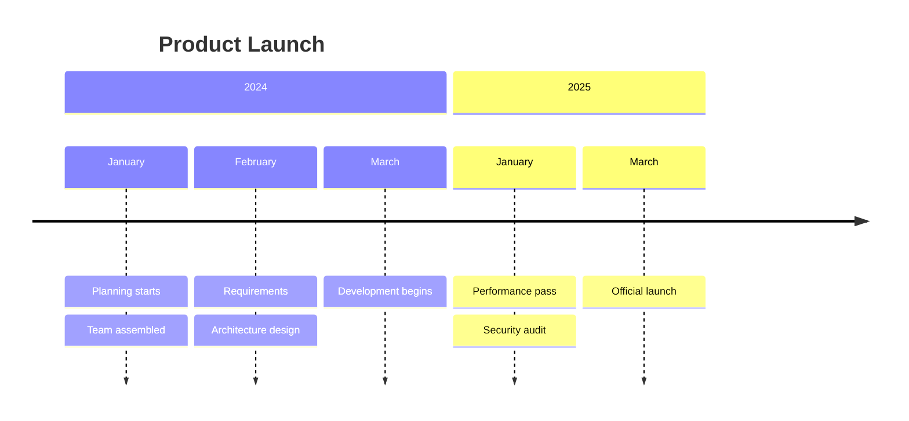
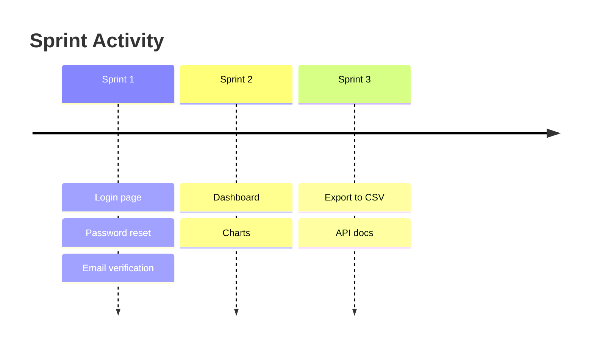
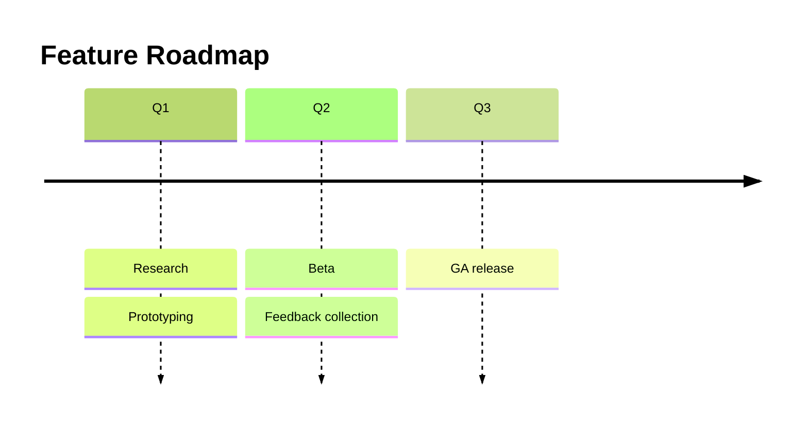
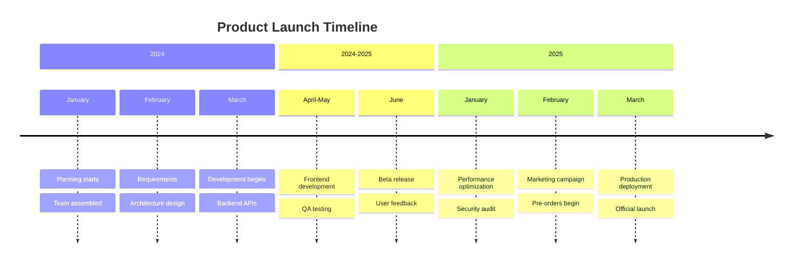
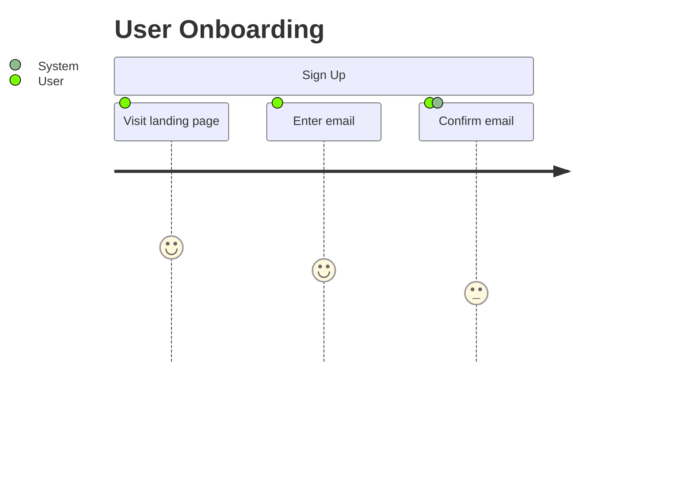
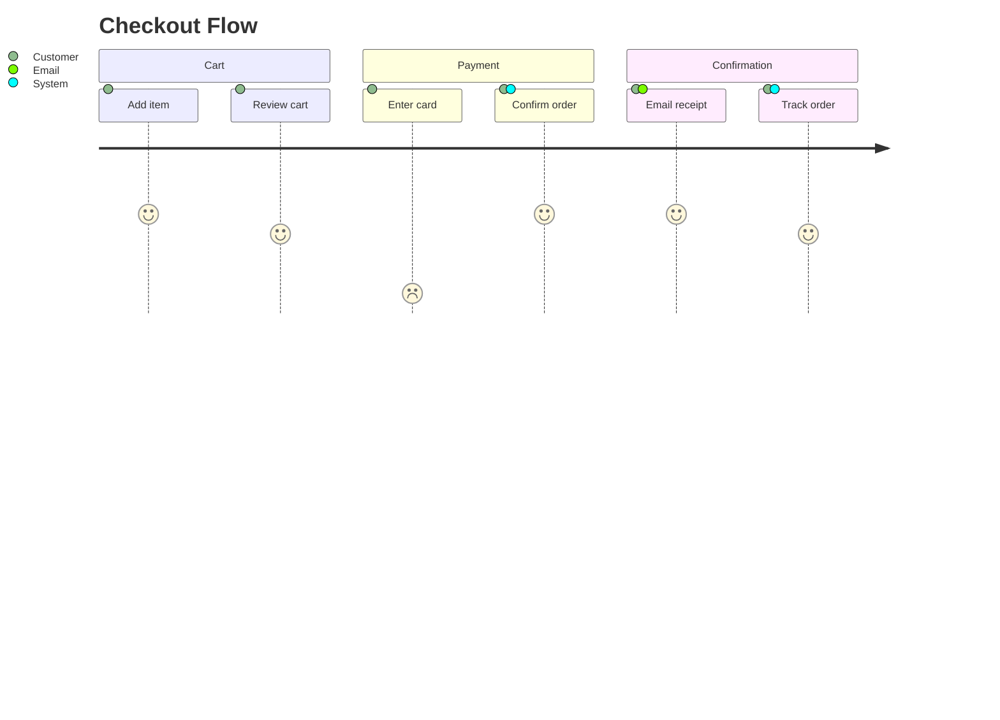
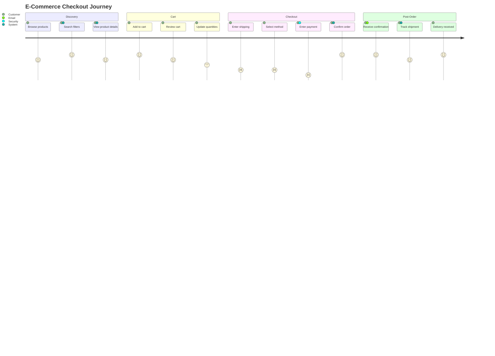

> Parent: [Mermaid Diagram Syntax](../SKILL.md)

# Timeline & User Journey

SOURCE: Official Mermaid.js documentation (<https://mermaid.js.org/syntax/timeline.html>, <https://mermaid.js.org/syntax/userJourney.html>) (accessed 2026-03-07)

---

## Timeline

**Declaration**: `timeline`

### Minimal Structure



### Time Periods and Events

Each line is a time period followed by one or more events separated by `:`:

```text
<time-period> : <event1> : <event2> : <event3>
```

Time periods are arbitrary text — dates, quarters, version names, years, or prose labels:



### Section Grouping

Use `section` to group related time periods under a heading:



### Multiple Events per Time Period

Append additional `: <event>` segments on the same line:



### Line Breaks in Event Text

Use `<br>` to force a line break inside an event label:

```text
Long feature name : First milestone<br>completed early
```

### Theme and Styling

Apply a theme via `%%{init}%%` front-matter:



Available themes: `default`, `forest`, `dark`, `neutral`, `base`.

### Complete Example



---

## User Journey

**Declaration**: `journey`

### Minimal Structure



### Task Syntax

```text
Task name : <score> : <Actor1>, <Actor2>
```

- **Task name** — free text describing the step
- **score** — satisfaction rating from 1 (low) to 5 (high)
- **Actors** — comma-separated list of participants involved in the step

Scores drive the bar height in the rendered chart. Multiple actors share the same bar.

### Score Range

| Score | Meaning              |
|-------|----------------------|
| 1     | Very unsatisfied     |
| 2     | Unsatisfied          |
| 3     | Neutral              |
| 4     | Satisfied            |
| 5     | Very satisfied       |

### Sections

Group steps into `section` blocks representing journey phases:



### Complete Example



---

## See Also

- [Flowchart Syntax](../SKILL.md)
- [Gantt](./gantt.md)
- [Git Graph](./git-graph.md)
