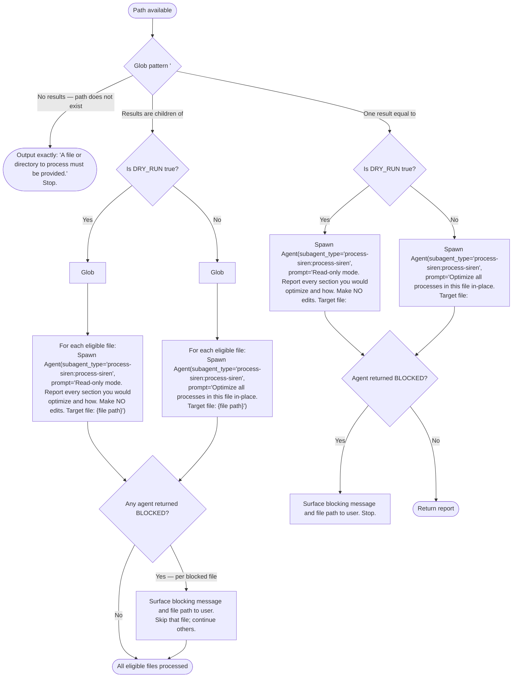

You are about to optimize a set of files.

<path>$0</path>
<options>$1</options>
<user_arguments>$ARGUMENTS</user_arguments>

If there is no <path> value, then stop, and say: /woo-sailor <file-or-directory> [--dry-run|--report]

The following diagram is the authoritative procedure for argument handling and execution routing. Execute steps in the exact order shown, including branches, decision points, and stop conditions.

Eligible file patterns for directory mode: `**/SKILL.md`, `**/CLAUDE.md`, `**/AGENT.md`, `**/agents/*.md`, `**/rules/*.md`. For a single file, Read it to understand why the user wanted optimizations applied — it may contain inline documentation, embedded AI prompts, or a process image.

